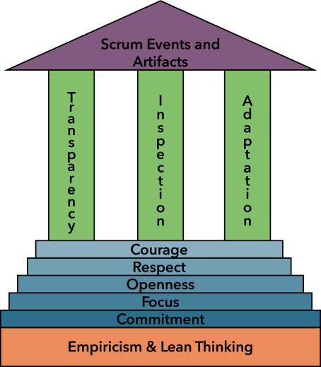
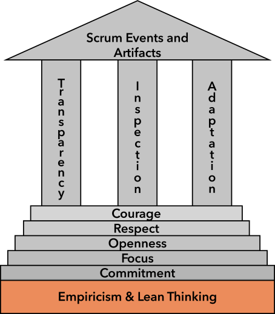
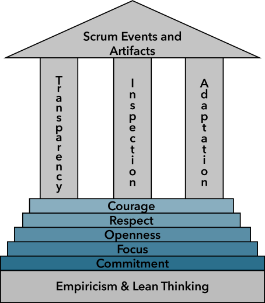
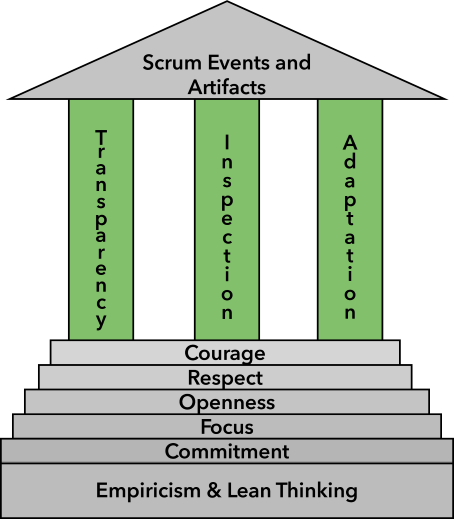
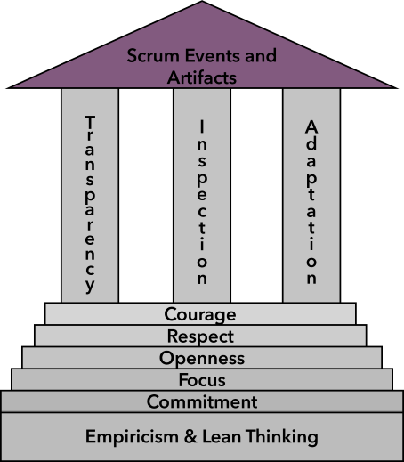
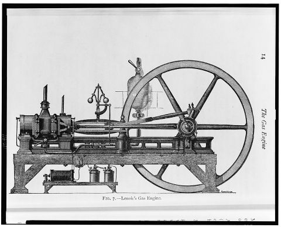
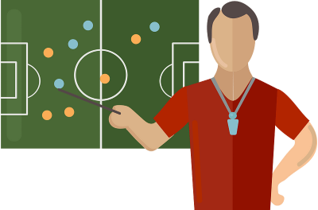

::: questions
-   What are the two key principles of Scrum Theory?
-   What are the five Scrum Values?
-   How do the Scrum Pillars relate to each other?
-   What are the responsibilities of each of the Scrum Team roles?
-   What are the commitments for each of the three Scrum Artifacts?
:::

::: objectives
-   Explain the Philosophy of Scrum
-   List and briefly describe the five Scrum Values
-   List and briefly describe the three Scrum Pillars
-   Describe the responsibilities of the three Scrum roles
-   Describe the primary artifacts and stages within Scrum and how they relate as a process
-   Describe the purpose of the sprint backlog and how it is used throughout a sprint
-   Define Definition of Done
:::

::: callout
*'Scrum is a lightweight framework that helps people, teams and organizations generate value through adaptive solutions for complex problems'* - The Scrum Guide
:::

# Scrum Philosophy

Scrum is is an **iterative** approach meaning that work is done in repeated cycles. 
Scrum is also **incremental**, with pieces of work building on one another. 

Scrum is intentionally incomplete: it defines only what is essential to implement Scrum theory, encouraging teams to build on it and adapt it to their context. Scrum can be used alongside or around existing practices, processes and frameworks. 

However, for Scrum to work effectively, you need to adopt a mindset and way of working that is underpinned by certain values and actions. 
These are defined in the Scrum Guide as the Principles, Values and Pillars.  

They can be depicted as a temple with the key principles of Empiricism and Lean Thinking as the foundations, the Values as the steps, and the Pillars holding up the roof of the temple.  The Scrum Events (i.e. everything that happens in the Sprint) can be thought of as part of the 'roof', and will only run effectively when the pillars, steps, and foundations are in place.

{alt='diagram of scrum philosophy, values, pillars and artifacts stacked on top of each other in the shape of a temple'}

## Key Principles of Scrum Theory

There are two key principles of Scrum Theory:

-   **Empiricism**: Decisions are based on observation and experience, not speculation. Work is guided by evidence and continuous learning.
-   **Lean Thinking**: Focus on delivering value while eliminating waste i.e. doing only what matters most.

{alt='diagram of scrum philosophy, values, pillars and artifacts stacked on top of each other in the shape of a temple with scrum philosophy highlighted as the foundations'}

:::: challenge
## Solo Exercise: Fill in the Blanks

3 mins.

We've just introduced some key concepts of Scrum philosophy.  To reinforce your learning, think about the information you've just read (or heard) and fill in the blanks to create sentences that accurately describe the philosophy of Scrum. 

1.  It is intentionally \_\_\_\_\_\_\_\_\_\_, meaning it provides only the essential structure and leaves room for adaptation.
2.  Scrum is based on \_\_\_\_\_\_\_\_\_\_, which means knowledge comes from experience and decisions are based on observation.
3.  It also draws on \_\_\_\_\_\_\_\_\_\_ thinking, which emphasises reducing waste and maximising value.
4.  Scrum is both \_\_\_\_\_\_\_\_\_\_ and \_\_\_\_\_\_\_\_\_\_, allowing teams to inspect and adapt regularly.

::: solution
1.  incomplete
2.  empiricism
3.  lean
4.  iterative, incremental
:::
::::

# Scrum Values

Scrum isn't only about what is done but how it is done.
Scrum has five values that encourage a healthy and productive working environment.
These guide the Scrum Team's work, actions and behaviour.

1.  Commitment - the Scrum Team commits to achieving its goals and supporting each other
2.  Focus - the primary focus of the Scrum Team is the work of the sprint to make the best possible progress toward the Sprint Goal.
3.  Openness - the Scrum Team and its stakeholders are open about the work and the challenges. This builds trust and surfaces problems early.
4.  Respect - Every team member is valued as capable and autonomous. Scrum works best in an environment of mutual respect.
5.  Courage - Scrum Team members need courage to tackle hard problems and speak truthfully.

Scrum only works when the team adopts the values it was built to support.

::: callout
*“Scrum is the framework I built to put those values into practice. There is no methodology.”* - Jeff Sutherland (co-creator of Scrum)
:::

{alt='diagram of scrum philosophy, values, pillars and artifacts stacked on top of each other in the shape of a temple with the steps to the temple highlighted and each step showing a value'}

::: challenge
## Pair Exercise: Scrum Values in Practice

3 mins.

Discuss the following questions with your partner:

-   Which Scrum Value do you think you would find hardest to put into practice? Why?
-   How could a team support each other in developing that Scrum Value?
:::

# Scrum Pillars

The effectiveness of Scrum relies on three core pillars, which are built on top of the foundations of Empiricism and Lean Thinking, and the steps of Scrum Values:

1.  **Transparency:** the process and work must be visible to those performing the work and stakeholders.
    Transparency is essential for effective inspection and adaptation.

2.  **Inspection:** the progress toward goals must be inspected to detect problems quickly.

3.  **Adaptation:** when problems are identified through inspection, the team must adapt to minimise any further deviation from the goal.

The pillars are interconnected and each one is critical to Scrum - without transparency, inspection is misleading. Without inspection, adaptation is impossible.

{alt='diagram of scrum philosophy, values, pillars and artifacts stacked on top of each other in the shape of a temple with the pillars highlighted'}

::: callout
## Consequences of a Lack of Transparency: From Inconvenience to Devastation

**Manipulating Burndown Charts**

An anecdote of Scrum ineffectiveness from Scrum.org describes how a team deliberately altered their burndown chart to align exactly with the ideal progress line on the chart.  The Scrum Team said that they were "manipulating the numbers so that the management does not bother them".

The empirical data was falsified, going against one of the key principles of Scrum theory.  This meant that the Scrum Team and wider organisation couldn't accurately inspect or adapt, making Sprint Planning and Review totally ineffective activities.

**Horizon IT British Post Office Scandal**

The Post Office’s Horizon accounting software, introduced in 1999, contained numerous bugs (e.g., duplicating ledger entries, phantom shortfalls) that erroneously implicated hundreds of subpostmasters in fraud.

The software company Fujitsu and the Post Office were aware of these serious issues as early as 1999–2002 but concealed them from the public, subpostmasters, and even prosecution courts. They denied errors and pressured individuals to cover unexplained deficits, while claiming system reliability in court.

This highlights the disastrous consequences that a lack of transparency can have.  
:::

# Scrum Artifacts and Commitments

The Scrum Artifacts are (virtual) objects that provide transparency about the work being done. They are the Scrum Team's source of truth.
They make visible what's being worked on, why it matters, and how close you are to delivering value.

There are three key Artifacts in Scrum: the **Product Backlog**, **Sprint Backlog** and **Increment**. 
Each Artifact is associated with a commitment (goal) to focus on the Scrum Team on where the project is heading.

{alt='diagram of scrum philosophy, values, pillars and artifacts stacked on top of each other in the shape of a temple with the roof of the temple highlighted and scrum artifacts written on it'}

## Product Backlog

The Product Backlog is an ordered list of everything the product might need including features, fixes, experiments, and improvements.
It evolves constantly based on things like feedback, market shifts, and changing stakeholder goals.
The Product Backlog belongs to the Product Owner, but anyone can contribute ideas.

### Commitment: Product Goal

The Product Goal is the long-term vision for the product.

::: callout
## Designing a Board Game: The Solent Voyage

Imagine you have an idea to create a board game 'The Solent Voyage', about a ship that sailed from Southampton in Roman times.

The Product Goal is:

“Create a fun board game that 4 friends can play in under an hour.”

The Product Backlog is your ever-evolving list of features and ideas:

-   Create player roles and abilities
-   Draft simple turn mechanics for the game
-   Design custom mechanics for each role's combat, trade, and movement
-   Write the a comprehensive rulebook
-   Decide win/lose conditions
-   Sketch a rough paper game board
-   Design custom artwork for the board
-   Print the game board onto high quality material
-   Create quick example cards
-   Design and print cards
-   Build a scoring system
-   Run a short 20-minute test with two players
-   Run a full test with four players
-   Gather feedback from players
-   Create custom miniatures for each character

Some items are critical (like the rules), others are stretch goals (like custom miniatures).

:::

## Sprint Backlog

The Sprint Backlog is the plan for the current block of work and is created at the start of each Sprint, during the Sprint Planning Meeting.
It includes:

-   A Sprint Goal.
-   A subset of the items from the Product Backlog that will be worked on during this Sprint.
-   An actionable plan for delivering a working increment by the end of the Sprint.

The Sprint Backlog is owned and maintained by the Developers.

### Commitment: Sprint Goal

The Sprint Goal is the primary objective for the current Sprint.

:::: challenge
## Group Exercise: Sprint Backlog for the Sail Away

3 mins.

You have the Sprint Goal: “Test the basic turn system with 2 players using paper placeholders.”

Discuss in your group:

Which items would you select from the Product Backlog for this Sprint?

::: solution

Your Sprint Backlog might include:

-   Draft simple turn mechanics for the game
-   Create quick example cards
-   Sketch a rough paper game board
-   Decide win/lose conditions
-   Run a short 20-minute test with two players
-   Gather feedback from players

:::

::::

::: callout

## Creating a Sprint Backlog in GitHub

To create a sprint backlog using GitHub issues:

- Create a new label e.g. 'Sprint 1' 
- Apply the label to the GitHub issues selected for Sprint 1
- Filter your issues to include only those with the label 'Sprint 1'

:::

## Increment

The Increment is the result of the Scrum Team's work during the Sprint and is a working, usable part of the product that meets any quality criteria that have been agreed.

The Increment includes the sum of all previous Increments and so it increases in value after every Sprint.

### Commitment: Definition of Done

In Scrum, the quality criteria that an Increment must meet are called the Definition of Done.

The Definition of Done for the Solent Voyage might be:

-   The rules are clear enough to play without additional explanation.
-   The components labelled and functional.
-   The test players complete a game.
-   Any bugs or confusing moments were documented.

:::: challenge
## Group Exercise: Coffee Beans Project Definition of Done

5 mins.

Discuss a Definition of Done for your team to use during the Coffee Beans Analysis Project and write it in your team's shared document 

::: solution

Your Definition of Done might require the Increment to be:

-   Integrated with the rest of the product
-   Passing some tests
-   Reviewed by another team member

:::

::::

# Scrum Team

The Scrum Team has a simple structure of one self-managing unit working toward a common goal. Scrum teams deliberately don't have a hierarchical structure to allow team members to make decisions and adapt quickly, without waiting for permission from higher-ups.

A Scrum Team includes:

-   Developers (usually 3-9 people)
-   One Product Owner
-   One Scrum Master

## Developers

In a software development project, most developers will probably be software engineers, but developers could also be designers, testers, data analysts or any other role doing work to turn ideas into a working product.

-   They are collectively responsible for delivering Done work.
-   They decide **how** to accomplish the Sprint Goal.
-   They create the work, inspect it, and adapt based on client or team member feedback.

You could think of developers as the engine of the team.

{alt='daigram of an old machine'}

## Product Owner

The Product Owner is responsible for maximising the value delivered by the Scrum Team.
The Product Owner is one single person, but they may represent a group of clients or other stakeholders.

-   Owns and manages the Product Backlog by ordering and refining it to ensure clarity for the rest of the Team
-   Represents the user perspective and works according to the business goals for the product.
-   Decides what gets built next but not how it gets built

You could think of the Product Owner as the compass, ensuring that the Scrum Team is always pointing toward the highest-value outcome.

{alt='compass and map'}

## Scrum Master

The Scrum Master ensures that the Scrum framework is understood and carried out correctly.

-   A servant leader, not a manager or a taskmaster.

-   Helps the team to remove blockers, improve flow, and reflect on what has gone well and what could be improved.

-   Supports the Scrum Team in applying Scrum effectively.

You could think of the Scrum Master as a coach, empowering the Scrum Team to work as effectively as possible.

{alt='football coach'}

::: callout
## Roles Aren't Always Fixed

In practice, Scrum Team roles are often flexible. Each person doesn't necessarily only take one role. 

For instance:

-   The Scrum Master role might rotate between several developers.
-   One person could even take on all three roles for a solo project. 

Scrum defines the roles but teams can adapt them to fit their context.

:::

::: challenge
## Group Exercise: Getting in the Mindset of a Scrum Master

5 mins.

Discuss within your group:

-   What skills or mindset would you need to succeed in the role of Scrum Master?
-   What challenges might you face in the role?

:::

## References

-   [Scrum Guide](https://scrumguides.org/scrum-guide.html)
-   [British Post Office Scandal Wikipedia](https://en.wikipedia.org/wiki/British_Post_Office_scandal)
-   [5 Reasons Leading to Scrum Team Ineffectiveness](https://www.scrum.org/resources/blog/5-reasons-leading-scrum-team-ineffectiveness)

::: keypoints
-   Scrum is an iterative, incremental, minimalist, and deliberately incomplete framework emphasizing empiricism and lean thinking.  
-   Scrum is built upon five core values: commitment, focus, openness, respect, and courage.  
-   Scrum relies on the three interconnected pillars of transparency, inspection, adaptation.  
-   A Scrum Team consists of Developers, a Product Owner, and a Scrum Master.  
-   Scrum makes use of three main artifacts which are the Product Backlog, Sprint Backlog, and Increment.
-   The Sprint Backlog includes a sprint goal, a subset of items from the Product Backlog selected for the current sprint, and an actionable plan for completing them. 
-   The Increment is the usable output from a sprint that must meet the Definition of Done, which is a checklist of quality standards for the Increment.  
-   Scrum roles and structures are defined but adaptable and teams should adjust them to fit their context.

:::
