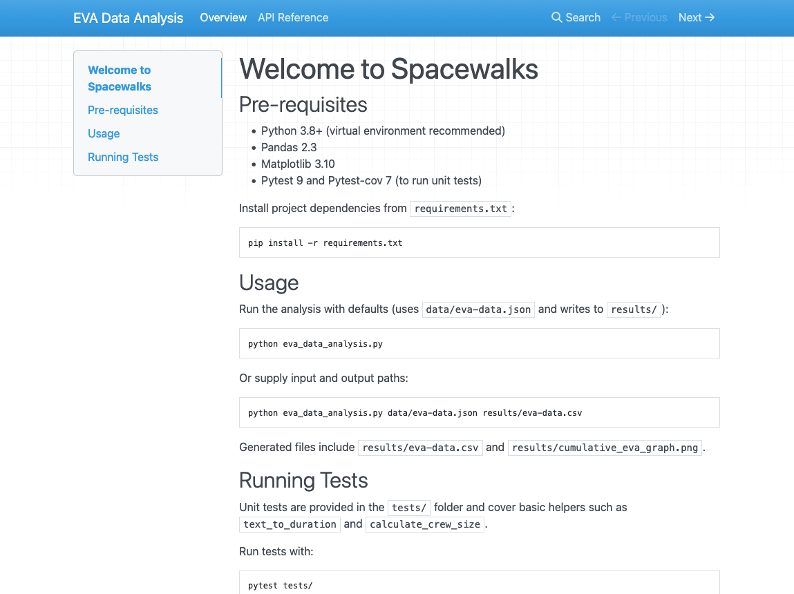

:::::::::::::::::::::::::::::::::::::: questions 

- What preparation should be considered prior to releasing software?
- How should I document my code?
- What tools help teams write and generate documentation?
- Why is licensing software important?
- How do I apply a software licence to code?
- What is the typical process to create a release on GitHub?

::::::::::::::::::::::::::::::::::::::::::::::::

::::::::::::::::::::::::::::::::::::: objectives

- Describe the different levels of software reusability
- Describe the purpose and main elements of a README file
- Describe the main types of software documentation
- Explore how to create basic project documentation using a documentation generator
- Explain why adding licensing information to a repository is important
- Outline your rights and obligations under common types of license (e.g. the GPL, MIT, BSD, Apache 2 and Creative Commons licenses)
- Understand how to create a release on GitHub

::::::::::::::::::::::::::::::::::::::::::::::::

In previous episodes we have looked at skills, practices, and tools to help us
design and develop software in a collaborative environment.
In this lesson we will be looking at
two critical pieces of the development puzzle that builds on what we have learnt so far -
reuse and sharing our software with others.

In this episode we'll look at the importance of software reusability,
and some key techniques and tools improve the reuse of software:

- **How and when to write documentation**, including how to create a project repository README file that supports new users getting started, and tools and infrastructure to make writing project documentation easier
- **What to consider with software licensing**, from the perspective of reusing licensed software and how to choose licences
- **How to create a release**, essentially creating a usable snapshot of your software for others to use

The overall aim is to provide you with some practical experience for these which you'll take forward into the second sprint which will include tasks in this area.


## What do we Mean by Reusability?

In industrial software development software reuse is a deliberate strategy for improving productivity,
quality, and delivery speed, by building on existing assets instead of developing everything from scratch.
Reuse can occur at multiple levels,
from individual code snippets and libraries to entire frameworks and system architectures.

:::::::::::::::::::::::::::::::::::::::  challenge

## Class Exercise: Why Reuse?

5 mins.

What are the benefits of reusable software?

:::::::::::::::  solution

- Increases productivity by using pre-built components, instead of "reinventing the wheel"
- Reduces development and maintenance costs, since despite a higher cost of incorporating reusability, this is paid off over time by minimising total effort required across projects that inherit that code
- Improves software quality and reliability, since reusing proven, tested components reduces introduction of new bugs
- Improves consistency across projects, by standardising development practices
- Faster onboarding and knowledge transfer, where common components and architectural patterns reduces subsequent ramping-up time across projects
- Increases scalability performance, since reusable components are often designed to be modular as opposed to monolithic, reducing effort required to scale applications

:::::::::::::::::::::::::

::::::::::::::::::::::::::::::::::::::::::::::::::

### What do we Want from Reuse?

Firstly, whilst we want to ensure our software is reusable by others, as well as ourselves,
we should be clear what we mean by 'reusable'.
There are a number of definitions out there,
but a helpful one written by [Benureau and Rougler in 2017](https://dx.doi.org/10.3389/fninf.2017.00069)
offers the following levels by which software can be characterised:

1. **Re-runnable** - the code is simply executable
  and can be run again (but there are no guarantees beyond that)
2. **Repeatable** - the software will produce the same result or behaviour more than once
3. **Reproducible** - results or behaviour generated from the same version of the software
  can be generated consistently given the same inputs
4. **Reusable** - easy to use, understand, maintain, and modify for others, as well as incorporate (as a whole or in part) into other development ventures

Later levels imply the earlier ones.

As developers we should always aim for reusable software.
It is crucial that we can write software that can be *understood*
and ideally *modified* by others within our team and elsewhere.
Where 'others', of course, can include a future version of ourselves.

### Levels of Software Reuse

Here are some example levels of software development reuse in industry:

1. **Code-level Reuse** - functions and small-scoped utility libraries, classes and objects
1. **Component-level Reuse** - larger self-contained software modules, packages, API, or microservices that provide specific functionality and have well-defined interfaces
1. **Design and Architectural-Level Reuse** - reuse of design patterns, frameworks, and architectural styles, or set of platform components conforming to an architecture
1. **System-level Reuse** - entire system or application used with other similar systems or components to create a new, larger system
1. **Document and Knowledge Reuse** - beyond code and design, the reuse of technical documentation, manuals (or their structural design or technical underpinning), and test plans or test scripts from similar projects

## The Need for Documentation

A cornerstone of software reusability is documentation.
Software development in industry typically adopts a longer-term, sustainable view of software that is produced.
Unlike small personal projects, industrial software is usually developed by teams over long periods of time,
often with developers joining and leaving the project.

Documentation thus ensures that knowledge about a given system is preserved and accessible,
and the extent to which that system is reusable is closely tied to its supporting documentation.
In many cases, beyond trivial software outputs, reusability is critically dependent on documentation since it's the main enabler for developers to find, understand, trust, and modify software components.

Good documentation:

- **Reduces development time** - when requirements, interfaces and behaviour are clearly documented
- **Reduces maintenance costs** - since clear documentation helps developers understand it to maintain, debug and extend the system without requiring the original authors
- **Improves quality and reliability** - because documentation of testing procedures, requirements, and design decisions helps ensure system continues to behave as expected
- **Increases knowledge transfer** - explaining how the system works in terms of its architecture, design decisions, and codebase
- **Improved compliance governance** - with some industries requiring documentation for regulatory or auditing purposes
- **Improved user support** - with user guides and manuals supporting the correct use of software by customers

Documentation therefore acts as a collective memory for the software being developed,
and you may notice the stroing overlap with the benefits of reusability,
and is therefore intrinsically tied to it.
It is difficult to have truly reusable software without documentation.
As a developer you will very likely find yourself involved in both sides of this reuse,
either as a producer, generating software to be reused,
or as a consumer, reusing software developed by others.

A golden rule of software development is to *always assume that someone else may need to both understand and run the software you have written*, which includes a future version of yourself.

### Types of Documentation

Software documentation can be grouped into several broad categories, each serving a different audience.

:::::::::::::::::::::::::::::::::::::::  challenge

## Class Exercise: Types of Documentation

2 mins.

What different types of software documentation have you generated or used from other software?

::::::::::::::::::::::::::::::::::::::::::::::::::

At a lower level, there is also **code commenting**,
a very useful form of documentation for understanding our code is code commenting,
and is most effective when used to explain complex interfaces or behaviour,
or the reasoning behind why something is coded a certain way.
We'll look into these shortly, but code comments only go so far.

Broadly speaking, supporting documentation tends to fall into:

- **Product documentation**, describing the the software as a whole, including it's purpose and aims, and key functionality
- **Requirements documentation**, such as a Software Requirements Specification (SRS) or user stories
- **Technical documentation**, such as architectural diagrams, technical specifications that support development, testing, and deployment, technical how-to guides, and documentation of APIs and database schemas
- **User documentation**, which describes how to use the functionality of the software for users
- **Process & project documentation**, which covers *how* the software is developed, e.g. the development workflow (for example, Git branching strategy), issue tracking and backlog documentation, continuous integration procedures, test plans, and release notes

:::::::::::::::::::::::::::::::::::::::::  callout

## Scrum and Documentation

From an agile Scrum perspective, documentation should be **minimalist** and **purposeful**.
Documentation should only be created and maintained that continues to add value,
and should be living documents that evolve with the product.

Essentially, create documentation when it is needed, as opposed to creating it initially all at once,
and documentation tasks (creation or amendment) should be included in the definition of done and completed within that given sprint cycle.
This helps avoid technical debt accruing over time, which applies equally to documentation as it does to the software itself.

::::::::::::::::::::::::::::::::::::::::::::::::::


## Licensing

Software licensing is a whole topic in itself, so we'll just summarise here.
Typically in industrial settings a licensing policy will already be in place,
whether the software is proprietary or being released as open source,
but it's still important to know some licensing fundamentals,
particularly when reusing other licensed software external to an employing company.

In IP law, software is considered a creative work of literature,
so any code you write automatically has copyright protection applied.
This copyright will usually belong to your employer.

:::::::::::::::::::::::::::::::::::::::  challenge

## Class Exercise: No Licence?

2 min.

By default, what do you think you are legally allowed to do with software that isn't licensed?

:::::::::::::::  solution

Since software is automatically under copyright, without a licence no one may:

- Copy it
- Distribute it
- Modify it
- Extend it
- Use it (actually unclear at present - this has not been properly tested in court yet)

:::::::::::::::::::::::::

::::::::::::::::::::::::::::::::::::::::::::::::::

Fundamentally there are two kinds of licence,
**Open Source licences** and **Proprietary licences**,
which serve slightly different purposes:

- *Proprietary licences* are designed to pass on limited rights to end users,
  and are most suitable if you want to commercialise your software.
  They tend to be customised to suit the requirements of the software
  and the institution to which it belongs -
  again your institutions IP team will be able to help here.
- *Open Source licences* are designed more to protect the rights of end users -
  they specifically grant permission to make modifications and redistribute the software to others.
  The [website Choose A License](https://choosealicense.com/) provides recommendations
  and a simple summary of some of the most common open source licences.

Within the open source licences, there are two categories, **copyleft** and **permissive**:

- The permissive licences such as MIT and the multiple variants of the BSD licence
  are designed to give maximum freedom to the end users of software.
  These licences allow the end user to do almost anything with the source code.
- The copyleft licences in the GPL still give a lot of freedom to the end users,
  but any code that they write based on GPLed code must also be licensed under the same licence.
  This gives the developer assurance that anyone building on their code is also
  contributing back to the community.
  It's actually a little more complicated than this,
  and the variants all have slightly different conditions and applicability,
  but this is the core of the licence.

Without understanding a given software licence, developers risk violating legal restrictions, e.g.
by incorporating code into a project that requires derivative work to be open source, or that prohibits certain types of redistribution.
Licences also affect how software can be integrated with other code,
shared with collaborators, and released to users.
Being aware of licensing requirements helps developers ensure compliance, avoid legal issues,
and make informed decisions about which software components can be safely reused within their projects.

If you want more information on particular licences,
the [Choose An Open-Source Licence](https://choosealicense.com/)
or [tl;dr Legal](https://tldrlegal.com/) sites can help.


## Creating a Copy of the Example Code Repository

For this lesson we'll need to create a new GitHub repository based on the contents of another repository.

1. Once logged into GitHub in a web browser,
go to https://github.com/softwaresaved/industry-skills-prepare-release
1. Select `Use this template`, and then select `Create a new repository` from the dropdown menu
1. On the next screen, ensure your personal GitHub account is selected in the `Owner` field, and fill in `Repository name` with `industry-skills-prepare-release`
1. Ensure the repository is set to `Public`
1. Select `Create repository`

You should be presented with the new repository's main page.
Next, we need to clone this repository onto our own machines,
using the Bash shell.
So firstly open a Bash shell (via Git Bash in Windows or Terminal on a Mac).
Then, on the command line,
navigate to where you'd like the example code to reside,
and use Git to clone it.

For example, to clone the repository in our home directory (replacing `github-account-name` with our own account),
and change directory to the repository contents:

```bash
cd
git clone https://github.com/github-account-name/industry-skills-prepare-release
cd industry-skills-prepare-release
```

We also need to switch to a particular branch in the repository for this episode:

```bash
git switch 07-software-documentation
```

## Examining the Example Code

Let's take a look at the example code, which resides in a single `eva_data_analysis.py` script by opening this in an editor.

The script is designed to analyse Extra Vehicular Activity (EVA) data from NASA missions,
generating a plot of cumulative time spent in "space walks" over the years.
The code makes use of the well-established [Pandas](https://pandas.pydata.org/) data analysis and [Matplotlib](https://matplotlib.org/) graph plotting libraries.

By looking at the `main()` function, we can see the script invokes a series of functions within the same script file to generate this plot:

- `read_json_to_dataframe()` - load the raw EVA data from a file in JSON format into a Pandas dataframe (a row/column structure that holds the data) so it can be analysed, and "clean" the data so it's usable
- `add_crew_size_column()` - add a new column to the dataframe that contains the number of crew on a particular mission
- `write_dataframe_to_csv()` - output the amended dataframe to a file using a Comma-Separate Value (CSV) format
- `plot_cumulative_time_in_space()` - once the data is sorted by date, call this function to generate a plot of cumulative time in space over time

There are also some other lower-level functions used by these higher-level functions - `text_to_duration()`, `add_duration_hours()`, `calculate_crew_size()`, and `add_crew_size_column()`.

Let us assume that we've been tasked with documenting this example code for reuse in a larger project.
Whilst the code already contains good code commenting, we also need to provide human-readable documentation outside of the codebase,
and then create a stable release of the code.
But let's check the code commenting first.

We run the code by first creating a virtual environment as we've done before,
activating it, and loading in the Python dependencies from a `requirements.txt` file,
and then running the script, e.g. on Linux or Mac:

```bash
python3 -m venv venv
source venv/bin/activate
python -m pip install -r requirements.txt
python eva_data_analysis.py
```

And we should be presented with our plot of total time in space over time.

The repository also contains some Pytest unit tests in `tests/test_eva_analysis.py` which contain tests for some of the functions.
We can run also these tests as we have before, which complete successfully:

```bash
python -m pytest tests/test_eva_analysis.py
```


## Code Commenting

Fortunately, our `eva_data_analysis.py` script is well commented,
and contains normal code comments as well as a number of a special type of comment known as a *docstring*.

Code comments are non-executable notes written within source code that explain what the code is doing, why certain decisions were made, or how particular parts of the program work.
They are ignored by the compiler or interpreter and exist solely to help developers understand, maintain, and collaborate on the code more effectively.
Comments are typically used to clarify complex logic, describe functions or sections of code,
and provide context that may not be obvious from the code itself.

Importantly, clear comments improve the readability of code, support collaboration within development teams, and reduce the risk of misunderstandings or errors when the code is revisited later.
With code commenting, typically explaining the *why* is more important than the *what*,
except where behaviour is complex or counter-intuitive and requires explanation.

In Python, we can comment by beginning with a `#`, and the rest of the line is ignored.

However, a special kind of comment exists called a documentation string, or *docstring*.
Docstrings are a special kind of comment for a function,
that explain what the function does, the parameters it expects, and what is returned.
You can also write docstrings for classes, methods, and modules,
but you should usually aim to add docstring comments to your code wherever you can,
particularly for critical or complex functions.

Docstrings are formatted using enclosing triple-quotes `"""`.

Let's look at an example docstring in `eva_data_analysis.py`, for the function `read_json_to_dataframe()`:

```python
def read_json_to_dataframe(input_file):
    """
    Read the data from a JSON file into a Pandas dataframe.
    Clean the data by removing any rows where the 'duration' value is missing.

    Args:
        input_file (file or str): The file object or path to the JSON file.

    Returns:
         eva_df (pd.DataFrame): The cleaned data as a dataframe structure
    """
    print(f'Reading JSON file {input_file}')
    # Read the data from a JSON file into a Pandas dataframe
    eva_df = pd.read_json(input_file, convert_dates=['date'], encoding='ascii')
    eva_df['eva'] = eva_df['eva'].astype(float)
    # Clean the data by removing any rows where duration is missing
    eva_df.dropna(axis=0, subset=['duration', 'date'], inplace=True)
    return eva_df
```

Here we can see a concise description of the function, which takes a path to an input file in JSON format, loads that file into a Pandas dataframe, cleans the data so it's usable, and returns that resulting dataframe.

## Documenting a Repository

### Project Documentation

A common approach to providing project-level documentation is to include a set of metadata files within the software repository alongside the source code.
Many of these files function as “social documentation”, describing the expectations and guidelines for how users and contributors should interact with the project.
The table below highlights some common examples of repository metadata files and their roles.

| File               | Description |
|--------------------|-------------|
| README.md          | Provides an overview of the project. It can either include inline information or pointers to separate installation instructions and dependencies, usage instructions for running the code or example use cases, links to other metadata files and technical documentation |
| CONTRIBUTING.md    | Explains to developers how to contribute code to the project including processes and standards that should be followed. It typically explains how to report issues, propose changes, submit pull requests, follow coding standards, and adhere to the project’s workflow (such as branching strategies or review processes). |
| CODE_OF_CONDUCT.md | Defines expected standards of conduct when engaging in a software project |
| LICENSE            | Defines the legal terms of using, modifying and distributing the code |
| CITATION.cff       | Provides instructions on how to cite the code, e.g. referencing a technical paper |
| AUTHORS.md         | Provides information on who authored the code |

In a typical industrial setup there will likely be a policy or expectations for which files to use and how to use them,
possibly with pre-existing templates or boilerplate for such files,
since a uniform approach for multiple projects will facilitate easier and more efficient reuse for team members.

### Writing a Project README

A repository README file is the first piece of documentation that people should read to acquaint themselves with the software.
It concisely explains what the software is about and what it is for,
and covers the steps necessary to obtain and install the software
and use it to accomplish basic tasks.

In short, it provides enough information across the documentation areas we looked at earlier for people to get started.
Think of it not as a comprehensive reference of all functionality,
but more a short tutorial with links to further information -
hence it should contain brief explanations and be focused on instructional steps.

Repository README files are typically written in Markdown format.
a lightweight markup language which is basically a text file with
some additional basic syntax to provide ways of formatting them.
A big advantage of them is that they can be read as plain-text files
or as source files for rendering them with formatting structures,
and are very quick to write.
GitHub provides a very useful [guide to writing Markdown](https://docs.github.com/en/get-started/writing-on-github/getting-started-with-writing-and-formatting-on-github/basic-writing-and-formatting-syntax) for its repositories.

Our repository already has a `README.md` split into typical sections,
briefly covering a brief description, technical pre-requisites needed for using the code,
as well as concise instructions for running it and its included unit tests.
It also includes information on the current maintainers, the licence used, the original authors and any other acknowledgements.
These elements together practically assists a new user coming to this repository with how to get started using and developing it,
with a clear, simple step-by-step narrative - importantly in a concise way that avoids overwhelming them.
It also includes supporting contact information if they want to get in touch with developers of the code.
These headings are not a definitive set,
and sections are dependent on the nature of the software.
For some good example READMEs, see [matiassingers' collection of Awesome README links](https://github.com/matiassingers/awesome-readme).


## Adding Supporting Technical Documentation

[MKDocs](https://www.mkdocs.org/) generates project documentation as a static website from Markdown files. The website can then be hosted on GitHub Pages or other static site hosting services, providing a user-friendly interface for accessing the documentation.

We can install MKDocs package using `pip`. Here we also install a plugin `mkdocstrings`, which will be used later.
We advise you to do this within a virtual environment you created before:

```bash
python3 -m pip install mkdocs mkdocstrings[python]
```

By default, `mkdocstrings` does not provide support for a specific language. Therefore, we specify `[python]` to install extra dependencies of `mkdocstrings` for Python language support.

After installation, you can intialize a new MKDocs project in our Python project:

```bash
python3 -m mkdocs new .
```

This will create two files in your project: `mkdocs.yml` and `docs/index.md`. The first file `mkdocs.yml` is the configuration file for your documentation site. It serves as the central configuration hub for your MKDocs documentation. It tells MKDocs how to structure your documentation site, which plugins and themes to use,
how to organize navigation, etc.

`docs/index.md` is the main page of your documentation. It is usually the landing page of your documentation site.

Let's first look at the `mkdocs.yml` file. It is almost empty now. We can edit it with the following basic configurations:

```yaml
site_name: EVA Data Analysis

nav:
  - Overview: index.md

plugins:
  - search
  - mkdocstrings
```

Here we give a name to our documentation site, `EVA Data Analysis`.
We set up the navigation menu with one item `Overview` that links to `index.md`. We also enable two plugins, `search` to provide search functionality in the documentation site, and `mkdocstrings` to automatically generate API reference documentation from Python docstrings, which we will see later.

We can try to render the documentation site locally and see what it looks like:

```bash
python3 -m mkdocs serve
```

This will start to build a local static documentation site and serve it at a local web server. 
By default, it will be available at `http://127.0.0.1:8000/`, which will also show in the terminal output.
You can open this URL in your web browser to view the documentation site.

The documentation site now consists of some default content about MKDocs. It is rendered from the `docs/index.md` file. Let's edit this file to add some relevant content about our project. For simplicity, we can borrow the content from our `README.md` file.

You can also add more pages to your documentation site by creating more Markdown files in the `docs/` directory, and update the `nav` section in `mkdocs.yml` to include these new pages. For example, we can create a new page for API (Application Programming Interface) reference documentation.

An API reference documents the functions, classes, and methods provided by your software, along with their parameters, return values, and usage examples. This is particularly useful for understanding how to interact with your code programmatically. With `mkdocs` and `mkdocstrings` plugin, we can automatically generate API reference documentation from the docstrings in our Python code.

Let's first create `docs/api.md` with the following content:

```markdown
# API Reference

:::analyse-coffee
```

Apart from the title, there is only one line `:::eva_data_analysis` in this file.
This is a special syntax provided by the `mkdocstrings` plugin to indicate that we want to generate API documentation for the `eva_data_analysis` module.
The plugin will parse the docstrings in this module and generate the corresponding documentation.

Now we can call `mkdocs serve` again to render the documentation site locally and check how the API reference page looks like.

Now we can see that all the functions defined in the `eva_data_analysis` module are automatically documented with their docstrings.

And also configure `mkdocs.yml` to use `google` style docstring format for `mkdocstrings` plugin:

```yaml
site_name: EVA Data Analysis

nav:
  - Overview: index.md
  - API Reference: api.md

plugins:
  - search
  - mkdocstrings:
      handlers:
        python:
          options:
            docstring_style: google
```

Then we can render the documentation site locally again with `mkdocs serve`, the input parameters and return values of the `load_csv` function are now nicely formatted in a table.

:::::::::::::::::::::::::::::::::::::::  challenge

## Solo Exercise: Edit `index.md`

10 mins.

Like GitHub repository READMEs, `mkdocs` documentation pages also use Markdown.
Using the `README.md` as a reference,
change the `docs/index.md` file to briefly reflect how to use the tool.
Include brief sections on:

- Pre-requisites
- Usage
- Running tests

Once complete, use `python3 -m mkdocs serve` to view and check your updated index file.

::::::::::::::::::::::::::::::::::::::::::::::::::

Once you are happy with the documentation site, you can deploy it to GitHub Pages so that others can access it online.
Do to this:

- Commit the changes we made to the repository:

```bash
git add mkdocs.yml docs/
git commit -m "Add documentation with MKDocs"
```

To deploy the documentation to GitHub Pages, you can use the following command:

```bash
python3 -m mkdocs gh-deploy
```

This command assumes you have access to the GitHub repository of the current project.
It will automatically create a new branch called `gh-pages` in your repository,
which will contain the static files of your documentation site, and push this branch to GitHub.

Once built on GitHub, you can view the generated repository documentation by going to https://github-username.github.io/industry-skills-prepare-release/.




## Tagging a Release in GitHub

There are many ways in which Git and GitHub can help us make a software release from our code.
For example, we can use the GitHub website to create a new release. 
Let's look at how to do this using Git **tagging** on the command line.

Let us see what tags we currently have in our repository:

```bash
$ git tag
```

Since we have not tagged any commits yet, there is unsurprisingly no output.

From a repository perspective, when creating the release (e.g. from the `main` branch) we must ensure that any feature branches intended for this release have been fully merged into the `main` branch.
In addition - *critically* - when we create a release, we must ensure that all of the backlog items in a given sprint meet the criteria specified in the Definition of Done (DoD) for the project.
A product backlog is only "done" when it meets all DoD criteria.

Once we are satisfied this is the case,
we can create a new tag on the last commit in our `main` branch by doing:

```bash
$ git tag -a 0.1.0 -m "Version 0.1.0"
```

So we can check the tags again:

```bash
$ git tag
```

A tag should now be listed:

```output
0.1.0
```

And also, for more information:

```bash
$ git show 0.1.0
```

So now we have added a tag, we need this reflected in our Github repository.
You can push this tag to your remote by doing:

```bash
$ git push origin 0.1.0
```

We can now use the more memorable tag to refer to this specific commit.
Plus, once we have pushed this back up to GitHub,
it appears as a specific release within our code repository
which can be downloaded in compressed `.zip` or `.tar.gz` formats.
Note that these downloads just contain the state of the repository at that commit,
and not its entire history.

Using tagging allows us to highlight commits that are particularly important,
which is very useful for *reproducibility and reuse* purposes.

## Summary

Software reuse is an important strategy in software development that improves productivity, quality, and delivery speed by building on existing components rather than creating everything from scratch.
Achieving this requires clear documentation, well-structured projects, and a clear release process, as well as practices that allow other developers (both within and outside a team) to understand and adapt the software.
Importantly, documentation acts as the collective memory of a software project, helping developers understand how it works, how to use it, and how it was developed.

Note that the tools and techniques we show are illustrative examples.
An industrial outfit will have their own policies, approaches and tools for documenting and creating releases,
but the principles here are transferrable and the important part is the continual (and normalised) process of coding, documenting and releasing within an agile process that is repeatable and efficient.


:::::::::::::::::::::::::::::::::::::: keypoints

- Software reuse improves productivity, quality and development speed by building on existing code and components rather than creating everything from scratch.
- Reuse can occur at multiple levels, including code snippets, software components, architectural designs, entire systems, and documentation.
- Reusable software should ideally be re-runnable, repeatable, reproducible, and ultimately reusable, meaning it is understandable, maintainable, and adaptable by others.
- Documentation is essential for reuse, helping developers understand, trust, and modify software over time.
- Repository documentation, such as README files and supporting metadata helps users and contributors understand how to use and interact with a project.
- Software licensing determines how code can be used, modified, and shared.
- Creating software releases provides stable snapshots of a project, which improves reproducibility, distribution, and reuse by others.

::::::::::::::::::::::::::::::::::::::::::::::::