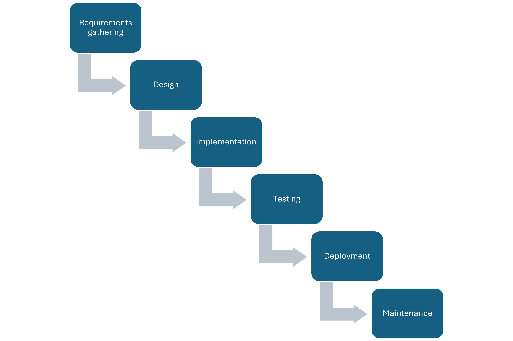
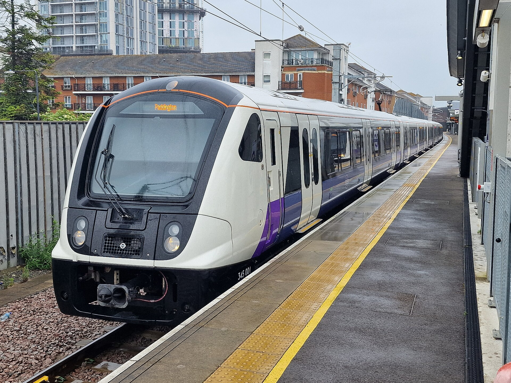
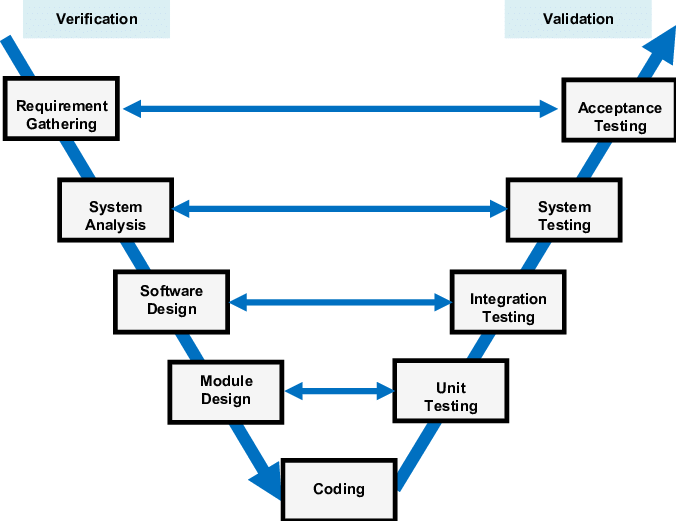
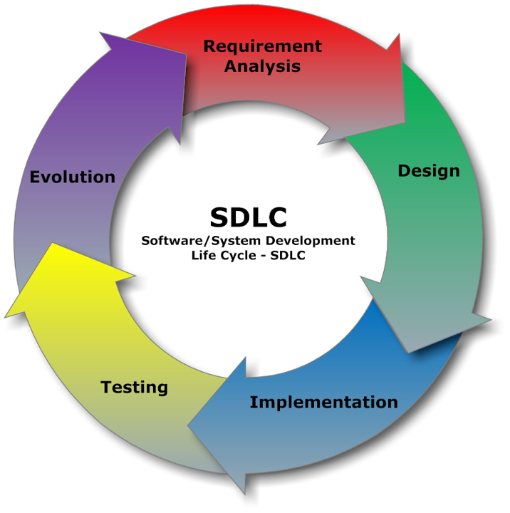
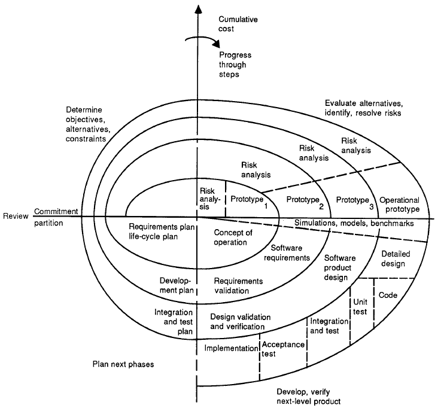
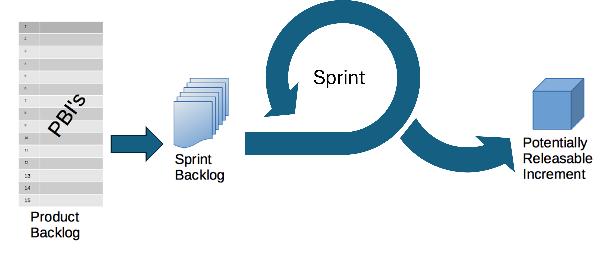

::: questions
-   What are the main stages in a typical software development process?
-   What are waterfall, iterative, and V-Model approaches to software development?
-   What is Agile and how does it compare to project management?
-   How do software development models compare and relate to project management frameworks?
:::

::: objectives
-   Highlight the main stages in a software development process
-   Order and describe the stages within a typical software development process and how these apply within waterfall and iterative approaches
-   Summarise the V-Model approach to software development
-   Describe how software development models compare and relate to project management frameworks [AgilePM, PRINCE2]
:::

## The Stages of a Typical Software Development Process

### Writing Code vs Engineering Software

Traditionally in academia, software and the process of writing it is often seen as a necessary but throwaway artefact in research.
For example, there may be research questions for a given research project, code is created to answer those questions, the code is run over some data and analysed, and finally a publication is written based on those results.
These steps are often taken informally.

The terms *programming* (or even *coding*) and *software engineering* are often used interchangeably.
They are not.
Programmers or coders tend to focus on one part of software development: implementation, more than any other.
In academic research, often they are writing software for themselves, where they are their own stakeholders.
And ideally, they write software from a design that fulfills a research goal to publish research papers.

Someone who is engineering software takes a wider view:

-   The *lifecycle* of software: recognises that software development is a *process* that proceeds from understanding what is needed, to writing the software and using/releasing it, to what happens afterwards.
-   Who will (or may) be involved: software is written for *stakeholders*. This may only be the researcher initially, but there is an understanding that others may become involved later (even if that is not evident yet). A good rule of thumb is to always assume that code will be read and used by others later on, which includes yourself!
-   Software (or code) is an asset: software inherently contains value - for example, in terms of what it can do, the lessons learned throughout its development, and as an implementation of a research approach (i.e. a particular research algorithm, process, or technical approach).
-   As an asset, it could be reused: again, it may not be evident initially that the software will have use beyond its initial purpose or project, but there is an assumption that the software - or even just a part of it - could be reused in the future.

::: challenge
## Let's Break it Down

**Solo Challenge**

Think about a project you've completed in the past.
This could be a software project but it doesn't have to be.
It could be anything from organising an event to completing a personal goal or managing a work task.

If you were to break down that project into stages, what would the stages be?
:::

### Software Development Process

The typical stages of a software development process are:

-   **Requirements gathering:** the process of identifying and recording the exact requirements for a software project before it begins. This helps maintain a clear direction throughout development, and sets clear targets for what the software needs to do.
-   **Design:** where the requirements are translated into an overall design for the software. It covers what will be the basic software 'components' and how they will fit together, as well as the tools and technologies that will be used, which will together address the requirements identified in the first stage.
-   **Implementation:** the software is developed according to the design, implementing the solution that meets the requirements set out in the requirements gathering stage.
-   **Testing:** the software is tested with the intent to discover and rectify any defects, and also to ensure that the software meets its defined requirements, i.e. does it actually do what it should do reliably?
-   **Deployment:** where the software is deployed or in some way released, and used for its intended purpose within its intended environment.
-   **Maintenance:** where updates are made to the software to ensure it remains fit for purpose, which typically involves fixing any further discovered issues and evolving it to meet new or changing requirements.

These stages are followed implicitly or explicitly in every software project but there are many different ways to arrange them.
The stages may be arranged according to an established model of software development.

## Models of Software Development

### Waterfall

{alt="diagram of the waterfall model"}

The Waterfall Model is a software development methodology in which the typical stages of the software development process (that we outlined above) are followed step-by-step in a set, sequential order.

The Waterfall Model is effective when used for projects where the requirements are clearly defined from the outset.
It is ideal for projects with long timelines and minimal tolerance for errors, where stakeholders require high confidence in the final outcome.

::: callout
[London's Crossrail project](https://learninglegacy.crossrail.co.uk/learning-legacy-themes/project-and-programme-management/initiation-and-development/) (later rebranded as the Elizabeth Line) used a Waterfall approach of clear, sequential phases. 
This approach was appropriate because the requirements were known from the start, with little possibility for change throughout the project.
The line spans 118km, serving 41 stations (10 new) and had been used for over 500 million journeys by early 2025 since its opening in 2022.
Despite the project delays and overspend, the Elizabeth Line was widely praised as an engineering triumph.

{alt="Elizabeth Line train 345001 at Abbey Wood"}
:::

However, there are some disadvantages to the Waterfall Model:

-   The model is relatively inflexible. Once a phase is completed, the model does not account for going back to make changes and therefore there is no mechanism for error correction.
-   The model assumes that project requirements are fully defined from the beginning, which is rarely the case for smaller, non-critical software projects, particularly in research.
-   The software is not seen by the client until late in the project timeline, which may increase the risk of it not meeting the client's expectations.

::: callout
The [myki ticketing system project](https://www.audit.vic.gov.au/report/operational-effectiveness-myki-ticketing-system?section=) in Melbourne, Australia, demonstrates some of the limitations of the Waterfall approach.

The myki ticketing system was designed to replace the Metcard system for Public Transport Victoria, improving the efficiency and reliability of public transport.
Almost \$1 billion was committed to this project in July 2005.

The project was expected to be completed in two years but ended up taking over nine years in total and the budgeted cost was exceeded by 55%.
Furthermore, due to the rigidly fixed scope and upfront planning, the system could not adapt to evolving user expectations or new technologies.
The system was plagued by multiple issues including overcharging, slow touch readers, top-up delays and limited device compatibility.

These issues were all symptomatic of the inflexible development process.
:::

### V-Model

The concept of the V-model was developed simultaneously, but independently, in Germany and in the United States in the late 1980s.

The V-Model emphasises the importance of validating each level of the software development.
This approach ensures that verification (checking work during development) and validation (checking final products against requirements) are systematically integrated throughout the process.

The left side of the V includes creation and verification steps, i.e. does it work according to the specification.

-   Requirements gathering

-   System design

-   Architectural design

-   Module design

-   Coding

The right side of the V includes validation for each step, i.e. have you built the right thing

-   Unit testing (validation for module design)

-   Integration testing (validation for architectural design)

-   System testing (validation for system design)

-   User acceptance testing (validation for requirements gathering)

{alt="image of the v-model of software development"}

The V-Model is used in safety-critical, regulated industries where traceability, formal verification and compliance with standards are essential.
These include:

-   Aerospace and defense

-   Automotive

-   Medical devices

-   Railways and transportation

::: callout
The V‑Model is a mandated development framework in German federal and defense software projects.

This originated in the late 1980s with the Ministry of Defense and later extended to civilian administration.
:::

Advantages

-   Focus on quality through early and continuous testing
-   The strong link between requirements and the final product improve the traceability of software changes.

Disadvantages

-   Not flexible so struggles to deal with changing requirements

-   Time-consuming due to extensive documentation and testing.

-   No support for development activities to occur concurrently or to iterate.

::: callout
The V-Model was used by [Siemens Healthineers](https://www.mdpi.com/2079-9292/13/11/2051) to develop their ultrasound systems Acuson SC2000 PRIME (from 2006) and Sequoia (from 2017).

The product had to be aligned with medical device regulations and so required the rigorous traceability that the V-Model enables.

Both projects used the V-Model alongside iterative approaches including Scrum.
:::

### Iterative

In many cases, it doesn't make sense for software development to follow a linear process such as the Waterfall or V model for a number of reasons.
For example:

-   Changes to a design mean that the requirements must be adjusted
-   A company may build on the same project for years, adding more complexity
-   The design of a key algorithm may need changing, leading to a need to change the implementation
-   A mistake is could be found during deployment which requires changes to the implementation

In iterative development, a large application is built in smaller, manageable parts called iterations.
Each iteration includes planning, design, development, and testing, and produces a working version of the product.
Unlike the Waterfall and V models, where the entire product is developed at once, iterative development adds features incrementally, with each cycle enhancing the functionality of the product.

{alt="image of iterative software development"}

::: callout
The evolution of Google’s search engine exemplifies the principles of Agile development through continuous iteration and adaptation.

Rather than being developed in a rigid, one-time release, Google Search has undergone thousands of incremental improvements, including hundreds of algorithm updates annually.

Now handling at least 8.5 billion searches daily, Google’s sustained success is built on a foundation of iterative enhancements, frequent feedback integration, and rapid deployment.
:::

#### Spiral Model

The Spiral Model, sometimes known as Boehm's Spiral, is an iterative, risk-driven approach to software development.
The approach allows for any mixture of software development approaches depending on the pattern of risk present in the project.
The model guides users to first determine objectives, second identify and resolve risks, third develop and test, and fourth plan the next iteration.
More recently, the spiral model has been thought of as a 'process model generator' because Boehm argues that choices based on a project's risks generate an appropriate process model for the project.

Decisions about how much effort should be directed into each element of the project is guided by the goal of minimising the overall risk.

{alt="image of the spiral model of software development"}

#### Agile

Agile software development is a phrase used to describe any iterative method which broadly follows a set of principles determined by a group of 17 software developers, called the Agile Alliance, at a meeting in Utah in 2001.
These principles, outlined in the Manifesto for Agile Software Development, are as follows:

-   Individuals and interactions over processes and tools

-   Working software over comprehensive documentation

-   Customer collaboration over contract negotiation

-   Responding to change over following a plan

The Agile Manifesto was inspired by the desire for a more rapid and lightweight approach to software development, as an alternative to the more heavyweight processes such as Waterfall and V-Model.
It drew on ideas from existing lightweight software development methods such as rapid application development, the rational unified process aka RUP, dynamic systems development method, scrum, extreme programming and feature driven development.
Although these methods were developed in the 1990s, before the Agile Manifesto, they are now all referred to under the umbrella term 'Agile' and, with the exception of Scrum, these methods have now gone out of fashion.

::: callout
Amazon embodies the Agile principle of customer collaboration through relentless feedback-driven iteration.

Amazon systematically gathers and acts on customer feedback to continually refine its products, and small, agile teams rapidly prototype and test ideas.

This Agile model has driven Amazon's extensive expansion into e-commerce, cloud (AWS), smart devices, and subscription services.
:::

Advantages of Iterative Development:

-   Progress on the software product can initially be faster as less time is spent on the requirements and design stages before starting implementation
-   Iterative approaches allow for continuous feedback, adaptation, and improvement throughout the project's lifecycle.
-   Defects can be found and corrected early, preventing them from affecting later stages.
-   After each iteration, feedback can be gathered from users, allowing for adjustments and improvements to meet their expectations.

Disadvantages of Iterative Development:

-   Without fully determined requirements and design, software can become messy or 'hacky' if quality control standards are not maintained
-   Since not all requirements are defined from the start, unforeseen changes may arise during the development process which require revision of the software architecture, costing more time in the long run.

::: callout
The [UK's Universal Credit welfare reform project](https://www.computerweekly.com/news/2240185166/Universal-Credit-will-cost-taxpayers-128bn) demonstrates that estimating timings and delivery costs can be challenging when using an Agile delivery method.

The project was initially budgeted at £2.2 billion but is estimated to have cost £15-16 billion.

Originally due to complete by 2017, the project end date is now 2028.
:::

#### Scrum

Scrum is one of the most popular Agile frameworks.
Scrum is defined in the Scrum Guide as 'a lightweight framework that helps people, teams and organisations generate value through adaptive solutions for complex problems'.
The core philosophy of Scrum is to make incremental progress toward a goal through repeated iterations.

In Scrum:

1.  A **Product Backlog** is created.
    This is a list of everything that needs to be done to build the product.

2.  Work is done in **Sprints**, which are short blocks of time (\< 1 month).

3.  At the start of a Sprint, a subset of the Product Backlog is selected to be worked on during the Sprint.
    This is called the **Sprint Backlog**.

4.  The developers work on tasks from the Sprint Backlog during the Sprint, creating an **Increment of Value.**

5.  The **Scrum Team** and its stakeholders inspect the results and adjust for the next Sprint.

6.  Repeat

{alt="simplified diagram of scrum with arrows showing that the product backlog is broken down into sprint backlogs and these are worked on throughout a sprint to create an increment of value"}

::: callout
## Scrum Buzzwords Decoded

-   Product Owner - responsible for maximising the value of the product.
-   Product Backlog - Ordered list of what is needed to improve the product.
-   Increment of Value - a concrete stepping stone toward the Product Goal.
-   Scrum Team - one Scrum Master, one Product Owner, and Developers (we'll discuss what each of these roles does later in the course).
-   Sprint Backlog - the set of Product Backlog items selected for the Sprint.
-   Sprint - Fixed-length events of one month or less in which the work gets done.
:::

Later in this course we will talk more about Scrum so that you are able to use it to run your own Sprints on a project.

## Which Model to Choose?

Any model can be used for any software development project.
Waterfall and V-Model and more likely to be used when all the requirements are known at the start of the project.
Iterative methods are particularly suited to prototyping, where quick development and user feedback help shape early versions of a system, and to research software, where evolving requirements and experimental objectives demand adaptability.
However, iterative approaches can be used on any project including those which are large scale and safety critical.

It's also worth noting that, to some extent, linear approaches become iterative in reality, as it is nearly always necessary to return to previous stages throughout the software development process.
For example, knowing 100% of the requirements from the start is nearly always impossible.
Even if a waterfall approach is applied, changes will most likely be made at each of the stages, requiring revision of an earlier stage.

::: challenge
## Model Matchmaking: What’s the Best Fit?

**Group Challenge**

Imagine you've been hired to develop a web-based system for managing applications for public research grants.
The portal will be used by applicants, reviewers and administrators.

-   The government has already defined **detailed and fixed requirements.**

-   There is **no flexibility in the deadline**, as it must go live before the start of the next fiscal year.

-   The system must be **fully tested and reliable on day one**, as errors could affect funding decisions.

-   Stakeholder involvement is minimal after the requirements have been approved.

**Your task:**

-   Discuss the project as a group and decide which software development model would be most suitable for delivering

-   Consider factors such as the nature of the project, clarity of requirements, timeline, risk, and the need for flexibility

-   Be prepared to **justify your choice** - why is this model a good fit for the scenario?
:::

In this course, we will focus on Agile, as it is currently a commonly used method for software engineering across sectors, and it suits the project that you'll be working on throughout this course.
In particular, we will focus on a an Agile framework called 'Scrum'.

## Scrum vs Project Management

Scrum is an Agile delivery technique that guides the actual software development process.
Scrum is concerned with delivering a project i.e. doing the actual software engineering.

Project management is concerned with all aspects of a project including planning, executing, and closing projects, as well as managing change and risk within a project.
Project management may contain Scrum but will also cover the wider project aspects including ensuring that a project meets its goals, timeline, and budget.

There are lots of project management frameworks.

To avoid confusion we should distinguish between Scrum (an Agile delivery technique) and Agile Project Management (AgilePM), which involves the application of Agile principles to managing projects.
AgilePM emphasises transparency, flexibility and meeting customer need, as well as allowing teams to have autonomy, make shared decisions and self-organise.

Another popular project management framework is PRINCE2 (PRojects IN Controlled Environments), which was developed by the UK government, and outlines seven principles, seven themes and seven processes to guide how a project should be managed.
It is a more heavyweight project management framework than Agile Project Management and so is often used in sectors where governance and documentation are priorities.

:::: challenge
## Software Development or Project Management?

**Group Challenge**

Below is a list of tasks, discuss whether each task belongs in software development models or project management models:

1.  Writing and testing code for a new feature
2.  Designing the software architecture for a system
3.  Creating a risk mitigation plan for project delivery
4.  Allocating team members across multiple concurrent projects
5.  Refactoring legacy code to improve maintainability
6.  Tracking project progress against the Gantt chart
7.  Setting up a version control system (e.g. Git)
8.  Reviewing whether the project is on track to meet its deadline and budget
9.  Leading a daily stand-up meeting
10. Leading a group retrospective to reflect on project outcomes and team performance

::: solution
1.  Software development
2.  Software development
3.  Project management
4.  Project management
5.  Software development
6.  Project management
7.  Software development
8.  Project management
9.  Could be either
10. Could be either
:::
::::

## References

-   Stages of Software Development from [Python Intermediate Development Carpentries Training](https://carpentries-incubator.github.io/python-intermediate-development/30-section3-intro.html)
-   [The Scrum Guide](https://scrumguides.org/)
-   [It's Time to End the Battle Between Waterfall and Agile](https://hbr.org/2023/10/its-time-to-end-the-battle-between-waterfall-and-agile)
-   Software Engineering by Ian Sommerville
-   Software Engineering: Theory and Practice by Shari Lawrence Pfleeger
-   [British Standards Online](https://library.soton.ac.uk/techinfo/standards)
-   [V-Model](https://en.wikipedia.org/wiki/V-model)
-   [Waterfall Model](https://en.wikipedia.org/wiki/Waterfall_model)
-   Iterative ideas from [Eastern Peak](https://easternpeak.com/definition/iterative-development/#:~:text=Iterative%20development%20is%20a%20software,%2C%20development%2C%20and%20testing%20steps.)
-   [Agile](https://en.wikipedia.org/wiki/Agile_software_development)
-   [PRINCE2](https://en.wikipedia.org/wiki/PRINCE2)

::: keypoints
-   The typical stages of a software development process are: requirements gathering, design, implementation, testing, deployment and maintenance
-   These stages are arranged differently in different models of software development
-   The Waterfall model follows the stages in a set, sequential order
-   The V-Model emphasises the importance of testing and validation at each stage
-   In iterative development, a large application is built in smaller, manageable parts called iterations.
-   Boehm’s Spiral is an iterative, risk-driven approach to software development
-   Agile software development is any iterative method that follows a set of Agile principles: Individuals and interactions over processes and tools; Working software over comprehensive documentation; Customer collaboration over contract negotiation; Responding to change over following a plan.
-   Any model can be used for any software development project but some may suit particular types of projects better than others
-   Scrum is one of the most popular Agile frameworks. Later in this course we will talk more about Scrum so that you are able to use it to run your own Sprints on a project.
-   Software development is concerned with delivering a project whereas project management will also cover the wider project aspects.
:::
