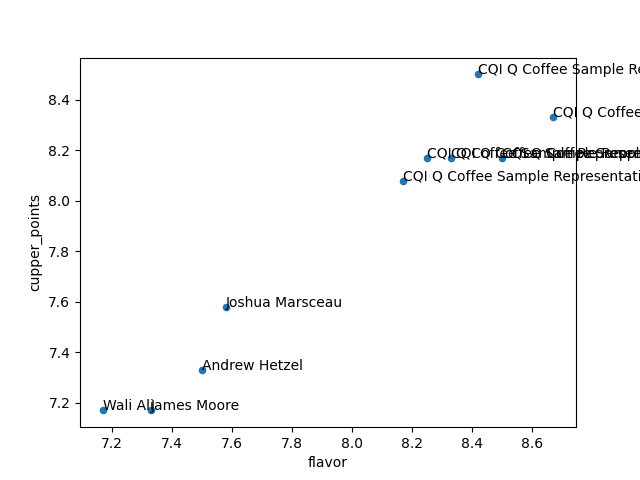
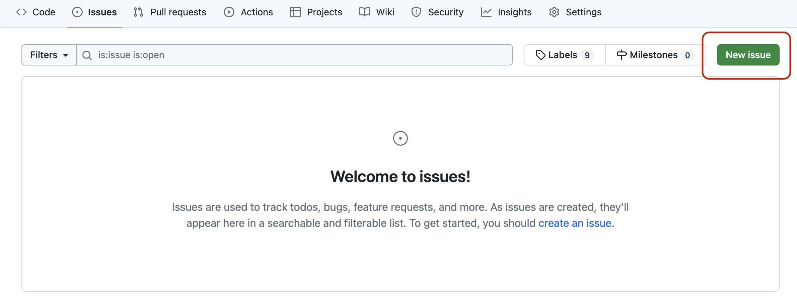
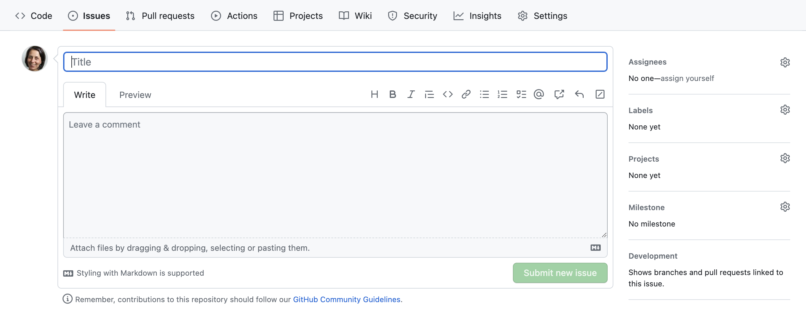
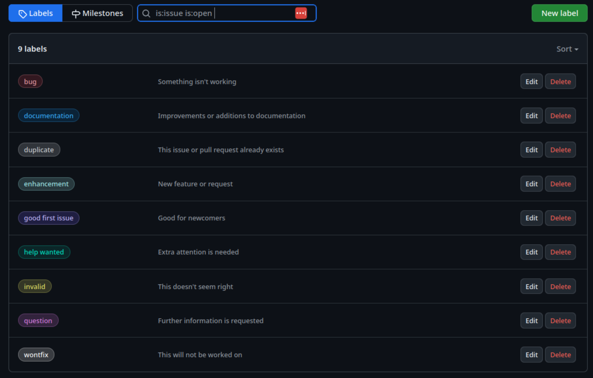

 
:::::::::::::::::::::::::::::::::::::: questions
 
- What types of requirements should be captured for a project?
- What is a non-functional requirement?
- How do I describe and ensure how desired features will provide value to the end user?
- How should I capture and manage requirements for change?

::::::::::::::::::::::::::::::::::::::::::::::::
 
::::::::::::::::::::::::::::::::::::: objectives
 
- Describe the key features of writing user stories
- Highlight the characteristics and differences between functional and non-functional requirements
- Describe the purpose and composition of the product backlog
- Describe what makes a good product requirement
- Create an initial product backlog from a given scenario

::::::::::::::::::::::::::::::::::::::::::::::::

In this section, we'll introduce two established key concepts for capturing the needs of a project,

- *User stories*, which capture what is needed from solely the perspective of the client
- *Requirements*, which state what needs to be built (or what needs to change) by the development team 

So whilst they both capture what the software will do,
each reflects one side of the client/developer perspective.


## User Stories: Understanding what is Needed from the User Perspective

Capturing "requirements" is pivotal to understanding what needs to be built,
but whilst they state what is technically required,
they lack the end-user context of what they are and why they are important.
User stories aim to capture this perspective, being short and simple descriptions of new features or functionality from the perspective of the end user themselves.
Therefore, user stories help:

- The project remains *user-centered* and *focused on real needs*,
rather than jumping prematurely to solution or technical requirements
- To clarify the the *value* behind a feature,
and anchor development in *user outcomes*, not just functionality
- Prevent requirements ballooning, if not guided by real user goals
- Prioritise what matters to users
- Provide a *concise* description of value - they should be short and encapsulate a single aspect

They typically follow the following template,
to ensure user stories are clear and concise:

> As a *[type of user]*, I want *[an action]* so that *[benefit]*.

Breaking each of these three aspects down:

- "As a *[type of user]*": who are we building this for? There may be more than one type of user, but in any case we need to think about this from the user's perspective.
- "I want *[an action]*": this describes the intent of this type of user, not the features of the system. What do they want to achieve?
- "so that *[benefit]*": what is the benefit they are trying to realise? How will it help them directly, solve a problem for them?

Some examples of user stories include:

- E-commerce site: as a shopper, I want to add items to my cart so that I can purchase multiple products at once
- Mobile application: as a user, I want to receive push notifications for important updates so that I stay informed when I'm not using the app

As mentioned, note that they are short and to the point,
and each encapsulate a single aspect.

FIXME: mention acceptance criteria for functional and non-functional requirements

:::::::::::::::::::::::::::::::::::::::  challenge

## Solo Exercise: User Stories

5 mins.

Consider this scenario:

*"A small town cheese-making business has received many enquiries about being able to make online purchases delivered to their homes or place of business,
and so now want to also sell their many types of cheeses using an online store.
Online customers are looking to be able to search the store, select cheeses to purchase,
and when ready, add payment and shipping details and confirm the order.
There is some evidence that some online customers are environmentally and ecologically conscious,
so are interested in the environmental impacts of products.
In order to schedule their supply chains efficiently, business customers are keen to have updates on shipping.
From the perspective of the business owner, they want to able to manage available stock inventory on the online store."*

Identify at least two types of user - also known as *personas* - that would use the store.
From the above scenario, create at least four user stories using this format:

> As a *[type of user]*, I want *[an action]* so that *[benefit]*.

Hint: focus on the user needs, not what may be implementated.

:::::::::::::::  solution

Here are some example user stories:

Business owner:

- As a business owner, I want to add new stock to the sit,e so that customers can purchase it.
- As a business owner, I want to remove old stock from the site, so that customers cannot purchase expired stock.

Personal customer:

- As a customer, I want to search available cheeses by name, so I can find the ones I want easily.
- As a customer, I want to add cheeses to a basket, so I can continue to shop and purchase them all later.

Eco-conscious customer:

- As an eco-conscious customer, I want to view the environmental impact details of products, so I can make environmentally-informed purchasing choices.

Business customer:

- As a business customer, I want to have real-time updates of orders that have been shipped, so I can organise my supply chains efficiently.

:::::::::::::::::::::::::

::::::::::::::::::::::::::::::::::::::::::::::::::


## What Exactly is a Requirement, and Why are they Important?

In general, a requirement is a *capability or condition that must be met for software to solve a problem or address a need*.
They form the foundation of our project and drive what will be developed,
so if we do not properly explore and understand what is required, the software will not be suitable for it's intended purpose.

Whilst user stories focus purely on the user perspective,
requirements concentrate on what technically needs to change.
For this reason, it's common to develop user stories first (to understand the user),
then from those stories,
derive requirements (to understand what needs to be built).
Requirements typically address technical aspects of software functionality and features that are needed to complete a user story,
and are more numerous than the collection of user stories.
Therefore, each user story is often addressed by more than one requirement.

There is repeated evidence that most errors aren't actually introduced during the software development stage,
but during requirements analysis and design.
For example, [one analysis](https://doi.org/10.1109/ISRE.1993.324825) of the software errors uncovered during integration and testing and the Voyager (1977) and Galileo (1989) probes discovered that 79% of these errors were due to a poor understanding of requirements.

However, it is unlikely that we will be able to determine all of the requirements correctly and completely upfront.
In practice, very often requirements may need be flexible to some extent and may change as the project evolves, so we need to ensure we are able to accommodate any agreed changes.

## Requirements are More than just Features

When considering software requirements, it is very tempting to just think about the features users need. 
However, many design choices in a software project depend on the users themselves and the environment in which the software is expected to run (as well as *how* the software should run),
and these aspects should be considered as part of the software’s *non-functional* requirements.

To explore the importance of this aspect, let's consider two software types, mobile applications and embedded software.
They may appear similar, but examining the environments in which they are developed and operate uncovers many differences that need to be accounted for in order for the software to be fit for purpose.

| Concern   | Mobile Apps | Embedded Software
|-----------|-------------|------------------
| Platform | Work on range of mobile hardware and iOS/Android operating systems | Exact specification of hardware is known - often not necessary to support multiple devices; typically low power
| Development Language | Typically written in one of the higher-level platform preferred languages (e.g. Java, Kotlin, Swift) | Typically lower-level language (e.g. C) for better control of resources
| Compilation | Users will not (usually) modify / compile the software | Users will not (usually) modify / compile the software
| Installation | Usually distributed via a controlled app store | Usually distributed pre-installed on a physical device
| Interface | Must have graphical interface suitable for a touch display | May have no user interface, or interface may be physical buttons
| Documentation | Probably in the software itself or on a Web page | Documentation probably in a technical manual with a separate user manual
| Uptime | May not run continuously due to restarts | May need to run continuously for the lifetime of the device

Therefore, whilst a single piece of software may provide the same *functionality* on a mobile app or embedded device (for example, a photo frame application),
the other *non-functional* considerations describe facets of how the software must be developed and how it must operate (often as constraints),
and we must account for them in our requirements.

:::::::::::::::::::::::::::::::::::::::  challenge

## Class Exercise: What Classes of Non-functional Requirements Are There?

5 mins.

As a class, what types of non-functional requirements can you think of?

:::::::::::::::  solution

Some typical classes of non-functional categories include:

- Security: how do we ensure a user is authenticated and authorised to conduct a particular action?
- Performance: what performance goals will the software be required to satisfy?
- Usability: how will the user interact with the software?
- Reproducibility: how do we ensure others are able to reproduce results generated using the software?
- Portability: to what extent should the software be able to run on different systems with minimal changes?
- Maintainability: how easily can the software be modified, enhanced, or restructured?
- Reliability: to what extent should the software we able to operate without errors and unexpected failures?
- Availability: to what extent should the software remain accessible and operational when needed?

A more comprehensive list can be found [on Wikipedia](https://en.wikipedia.org/wiki/Non-functional_requirement#Examples).

:::::::::::::::::::::::::

::::::::::::::::::::::::::::::::::::::::::::::::::


## Introducing the Coffee Beans Analysis Project

Throughout the course, we'll be making use of a hypothetical scenario
where a fictional coffee company is looking for a small software company to do some software development and analysis for them on an existing dataset.

Often at the start of a project, you might learn some information about the domain you're working in so that you can better communicate with the client and understand the problem at hand.

:::callout
### A Note on Coffee Production

A **coffee bean** is a seed from the Coffea plant and the source for coffee. This fruit is often referred to as a coffee cherry, but unlike the cherry, which usually contains a single pit, it is a **berry** with most commonly two seeds with their flat sides together. Even though the seeds are not technically beans, they are referred to as such because of their resemblance to true beans

The two most economically important varieties of coffee plant are the **Arabica** and the **Robusta**; ~60% of the coffee produced worldwide is Arabica and ~40% is Robusta. Arabica beans consist of 0.8–1.4% caffeine and Robusta beans consist of 1.7–4% caffeine.

As coffee is one of the world's **most widely consumed beverages**, coffee beans are a major cash crop and an **important export product**, accounting for over 50% of some developing nations' foreign exchange earnings. The global coffee industry is valued at **$495.50 billion**, as of 2023; the largest producer of coffee and coffee beans is Brazil. Other main exporters of coffee beans are Colombia, Vietnam, and Ethiopia. 

Two methods are primarily used to process coffee berries. The first, **"wet" or "washed" process**, has historically usually been carried out in Central America and areas of Africa. The flesh of the cherries is separated from the seeds and then the seeds are fermented – soaked in water for about two days. This softens the mucilage, which is a sticky pulp residue that is still attached to the seeds. Then this mucilage is washed off with water.

The **"dry processing"** method, cheaper and simpler, was historically used for lower-quality beans in Brazil and much of Africa, but now brings a premium when done well. Twigs and other foreign objects are separated from the berries and the fruit is then spread out in the sun on concrete, bricks or raised beds for 2–3 weeks, turned regularly for even drying. 

**Coffee cupping**, or coffee tasting, is the practice of observing the tastes and aromas of brewed coffee. It is a professional practice but can be done informally by anyone or by professionals known as "Q Graders". A standard coffee cupping procedure involves deeply **sniffing** the coffee, then loudly **slurping** the coffee so it spreads to the back of the tongue. The coffee taster attempts to measure aspects of the coffee's taste, specifically the **body** (the texture or mouthfeel, such as oiliness), **sweetness**, **acidity** (a sharp and tangy feeling, like when biting into an orange), **flavour** (the characters in the cup), and **aftertaste**. 
:::

### Project Brief

(Download a [PDF of the Project Brief](files/coffee-beans-project-brief.pdf))

We are a coffee company based in Southampton, UK, and are looking to improve where we
source our coffee from. The quality of coffee sourced from our existing suppliers has significantly
reduced in recent years, so we want to change suppliers whilst maintaining our reputation as the
best artisanal coffee place in town.

We have obtained a wealth of coffee supplier data from the independent Coffee Quality Institute.  We would like to use this data to help us decide where to send our coffee buyers to negotiate a new supply. However, we lack the skills required to analyse the data so we would like the help of your software team. 

We would like an answer to the following question: **"Which country should we send our buyers
to?”**

-   We need you to provide evidence for your choice, including statistics and visualisations of all relevant
variables that have impacted your choice
-   We need the modified code to be supplied in a GitHub repository, with documentation that
provides instructions for us to easily re-run your analysis code to reproduce your findings

Please bear in mind the following information about the coffee preferences of our business and customers:

-   A survey found that our customers care most about the flavour, aroma, body and uniformity of their coffee. 
-   Our customers prefer coffee with a lower caffeine content.
-   We would prefer to send our buyers to a country with lots of coffee producers so that they can visit multiple producers during their visit.
-   We have a preference for washed/wet processing of beans because it results in a more consistent and predictable flavour profile.

### Dataset

The data comes from the [Coffee Quality Institute](https://database.coffeeinstitute.org/) and was assembled by Data Scientist James LeDoux into the [Coffee Quality Database GitHub Repository](https://github.com/jldbc/coffee-quality-database).  The data contains reviews of 1312 arabica and 28 robusta coffee beans from the Coffee Quality Institute's trained reviewers. The features include:

**Quality measures**

-   Aroma
-   Flavour
-   Aftertaste
-   Acidity
-   Body
-   Balance
-   Uniformity
-   Cup Cleanliness
-   Sweetness
-   Moisture
-   Defects

**Bean Metadata**


-   Processing Method
-   Colour
-   Species (arabica / robusta)

**Farm Metadata**

-   Owner
-   Country of Origin
-   Farm Name
-   Lot Number
-   Mill
-   Company
-   Altitude
-   Region

The data is not perfect, which may present some challenges for analysis. For example:
Some of the data is missing, largely indicated by NA (not available) for data in some columns, e.g. "mill", "variety" and "processing_method"
The units used in some columns is inconsistent, e.g. "bag_weight" contains data in both kilograms and pounds


### Data Dictionary

We have created a simplified version of the dataset, which contains the following variables:

| Variable               | Class      | Description                                             |
|-------------------------|-----------|---------------------------------------------------------|
| species                 | character | Species of coffee bean (arabica or robusta)             |
| owner                   | character | Owner of the farm                                      |
| country_of_origin       | character | Where the bean came from                               |
| farm_name               | character | Name of the farm                                       |
| lot_number              | character | Lot number of the beans tested                         |
| mill                    | character | Mill where the beans were processed                    |
| company                 | character | Company name                                           |
| altitude                | character | Altitude |
| region                  | character | Region where bean came from                            |
| producer                | character | Producer of the roasted bean                           |
| number_of_bags          | double    | Number of bags tested                                  |
| bag_weight              | character | Bag weight tested                                      |
| in_country_partner      | character | Partner for the country                                |
| harvest_year            | character | When the beans were harvested (year)                   |
| grading_date            | character | When the beans were graded                             |
| owner_1                 | character | Who owns the beans                                     |
| variety                 | character | Variety of the beans                                   |
| processing_method       | character | Method for processing                                  |
| aroma                   | double    | Aroma grade                                            |
| flavor                  | double    | Flavor grade                                           |
| aftertaste              | double    | Aftertaste grade                                       |
| acidity                 | double    | Acidity grade                                          |
| body                    | double    | Body grade                                             |
| balance                 | double    | Balance grade                                          |
| uniformity              | double    | Uniformity grade                                       |
| clean_cup               | double    | Clean cup grade                                        |
| sweetness               | double    | Sweetness grade                                        |
| cupper_points           | double    | Cupper Points (higher score = superior quality)        |
| moisture                | double    | Moisture Grade                                         |


### Data Download

You can download a csv file of the data by clicking here: [Download coffee ratings dataset](data/simplified_coffee_ratings.csv)

Note: We found this dataset through TidyTuesday, a weekly social data project organised by the Data Science Learning Community


### Existing Code

From the coffee company:

We have some existing code that was developed by a part-time barista who was studying computer science at the University. We would like to build on this existing code, whilst ensuring we're able to run the updated code ourselves in the future.

This code generates a visual plot of United States coffee suppliers in terms of flavor and cupper points, and can be found at [https://github.com/softwaresaved/coffee-analysis](https://github.com/softwaresaved/coffee-analysis). It is not currently documented, but can be run using the following commands:

```bash
python3 -m venv venv
source venv/bin/activate
pip install -r requirements.txt
python analyse-coffee.py
```

The code produces the following plot:



The plot is quite confusing and doesn't help us, but please use the code as a starting point if it's helpful to you at all.  

### Plan for the Coffee Beans Analysis Project

Over the next five days, you will work in teams on the coffee beans analysis project.

-   On Day 1 (today), you'll develop the product backlog for the project.
-   On Day 2, you'll meet with the client (someone role playing as the coffee company owner) and you'll have your first Sprint Planning Meeting.
-   On Day 3, you'll conduct Sprint 1! You'll hold a stand-up meeting, work on the project during a three hour block, then hold a Sprint Review and Sprint Retrospective (we'll explain more about what these are later on).
-   On Day 4, you'll conduct Sprint 2, including the Sprint Planning Meeting, three hour work block, Sprint Review and Sprint Retrospective.
-   On Day 5, you'll present your work to the client and a panel of judges.  


Bear in mind that this training course focuses on the process of software development rather than the work itself.  You only have a total of 6 hours to actually work on the coffee beans analysis project, so we're not expecting anything complex or large-scale.  


## Let's get started with the Coffee Beans Analysis Project!

:::::::::::::::::::::::::::::::::::::::  challenge

## Solo Exercise: Develop User Stories

5 mins.

Read through the project brief linked above, and write down some user stories (no more than 6).
The project is only concerned with the needs of the coffee company,
so you only need to consider that as a single user type or persona.

Reminder of user story format:

> As a *[type of user]*, I want *[an action]* so that *[benefit]*.


:::::::::::::::  solution

Some examples:

- As a coffee provider, I want to understand from which suppliers to source the best coffee beans, so that we maintain our artisanal reputation.
- As a coffee provider, I want to understand how many suppliers exist in each country, so that we can simplify our supplier chain.
- As a coffee provider, I want the resultant code to be reproducible and documented, so that I can regenerate results from previous analyses.

:::::::::::::::::::::::::

::::::::::::::::::::::::::::::::::::::::::::::::::

:::::::::::::::::::::::::::::::::::::::  challenge

## Group Exercise: Create a Product Repository

10 mins.

For this course each group will create it's own GitHub software repository,
based on another repository that contains the original client code that will be adapted.

First, select one member of the group to create the repository,
who needs to:

1. Go to https://github.com/softwaresaved/coffee-analysis on GitHub.
1. Select the `Use this template` button on the right, and then `Create a new repository`.
1. On the following page, enter a suitable owner (such as yourself) and the repository name (such as `coffee-analysis`), and ensure the repository is public. Ordinarily in such circumstances, development would very likely be private, but for the purposes of training, select a public repository.
1. Select `Create repository`

A new repository will be created, with the contents of the original repository included.

Secondly, each member of the group needs to be invited to collaborate on the repository,
to ensure they have access.
The individual who created the repository thus needs to:

1. Select `Settings` on the new repository page, then select `Collaborators` (you may need to provide additional authentication for this step).
1. On the `Collaborators and teams` page, under `Manage access`, select `Add people`.
1. In the pop-up box, you should be able to search for each group member's GitHub account by username, and select `Add to repository` to send an invite.
1. Each new member will need to accept the invite, which is sent out by email.

::::::::::::::::::::::::::::::::::::::::::::::::::


## Capturing Requirements in a Product Backlog

A *product backlog* is a prioritised list of functionality that a product should contain;
essentially, a list of work for the development team.
It represents everything that might be needed in the product and is the single source of truth for all work.
They include requirement-related aspects such as features, bugs, improvements, and non-functional requirements,
but also any other supporting tasks such as any needed research (also known as *spikes*),
and other implementation-related tasks (like cleaning up/refactoring code).

A product backlog is owned by the *product owner* (the client),
and is dynamic, in that it evolves as the needs of the product evolves.
Regular backlog refinement sessions throughout a project ensure items are updated, estimated,
re-prioritised if necessary, and ready for upcoming sprints.

### Using GitHub Issues to Manage Requirements

For a given repository, GitHub provides *Issues* - a framework for managing bug reports, feature requests, and lists of future work which is ideal for our needs.

Go back to the home page for your repository in GitHub, and click on the `Issues` tab. 
You should see a page listing the open issues on your repository - currently there should be none.
The issues we add here will form our product backlog.

{alt='List of project issues in GitHub' .image-with-shadow width="1000px"}

:::::::::::::::::::::::::::::::::::::::: callout

## The Issues aren't Visible!

If you do not see the `Issues` tab, the repository owner needs to enable it in the settings of the repository:
go to the `Settings` tab, scroll down to the `Features` section, and activate the checkmark on `Issues`.

::::::::::::::::::::::::::::::::::::::::::::::::


From the `Issues` tab you can create new issues by selecting `New Issue`:

{alt='Creating a new issue in GitHub' .image-with-shadow width="1000px"}

When you create an issue, you can add a range of details to them.
They can be *assigned to a specific developer* for example -
this can be a helpful way to know who, if anyone, is currently working to fix the issue,
or a way to assign responsibility to someone to deal with it.

They can also be assigned a *label*.
The labels available for issues can be customised,
and given a colour,
allowing you to see at a glance the state of your code's issues.
The [default labels available in GitHub](https://docs.github.com/en/issues/using-labels-and-milestones-to-track-work/managing-labels) include:

- `bug` - indicates an unexpected problem or unintended behavior
- `documentation` - indicates a need for improvements or additions to documentation
- `duplicate` - indicates similar or already reported issues, pull requests, or discussions
- `enhancement` - indicates new feature requests,
  or if they are created by a developer, indicate planned new features
- `good first issue` - indicates a good issue for first-time contributors
- `help wanted` - indicates that a maintainer wants help on an issue or pull request
- `invalid` - indicates that an issue, pull request, or discussion is no longer relevant
- `question` - indicates that an issue, pull request, or discussion needs more information
- `wontfix` - indicates that work will not continue on an issue, pull request, or discussion

### Adding New Issue Labels

Many of these label types are useful,
but what if we need to add new labels?

If we go to our `Issues` tab, then select `Labels` next to the search box,
we should see a list of existing issue labels:

{alt='Issue labels in GitHub' .image-with-shadow width="1000px"}

By selecting `New label`, we specify a new label name, description, and even a new label colour, before selecting `Create label`.

### Add our Coffee Analysis Requirements to a Product Backlog

:::::::::::::::::::::::::::::::::::::::  challenge

## Class Exercise: What Makes a Good Requirement?

5 mins.

As a class, discuss which characteristics make a good requirement.

:::::::::::::::  solution

In general, a good requirement is:

- Clear and concise - there shouldn't be any confusion regarding its interpretation
- Valuable - is relevant to the project by addressing a user need
- Singular in scope - articulating a single need or quality attribute
- Actionable - is sufficiently concrete and detailed enough to be implementable
- Attainable - is realistic enough in scope to be achieved within a reasonable timeframe
- Verifiable/testable - any solution that addresses the requirement can be verified to satisfy that requirement

:::::::::::::::::::::::::

::::::::::::::::::::::::::::::::::::::::::::::::::

:::::::::::::::::::::::::::::::::::::::  challenge

## Group Exercise: Create a Product Backlog

15 mins.

As a group:

1. Examine the project brief and identify (perhaps around 10-15) key requirements for the project,
noting them down in your shared team GoogleDoc.
2. Once you have your list, add these as new issues to your product backlog in GitHub,
assigning an appropriate label to classify the type of issue.

For our purposes it would be good to label some issues as a new `feature` as well
(as opposed to an `enhancement` of existing code),
so have one member of the team add this as a new type of label and use that where appropriate.

Be sure to add a suitable (and concise) description for the issue.

::::::::::::::::::::::::::::::::::::::::::::::::::

## References

-   [Wikipedia on coffee beans](https://en.wikipedia.org/wiki/Coffee_bean)
-   [Wikipedia on coffee cupping](https://en.wikipedia.org/wiki/Coffee_cupping)


:::::::::::::::::::::::::::::::::::::: keypoints
 
- User Stories help to understand project needs from the perspective of the client
- User Stories follow the format `As a [type of user], I want [an action] so that [benefit]`
- Clear and well understood requirements are fundamental to a successful project
- Evidence that most project errors are introduced during the handling of requirements
- Requirements will change over time, and we need to allow and manage for that
- Requirements are more than just features: non-functional requirements capture the environment and how and in what way the software should operate and be provided
- A product backlog is a prioritised list of desired product functionality owned by the product owner (typically the client)

::::::::::::::::::::::::::::::::::::::::::::::::
