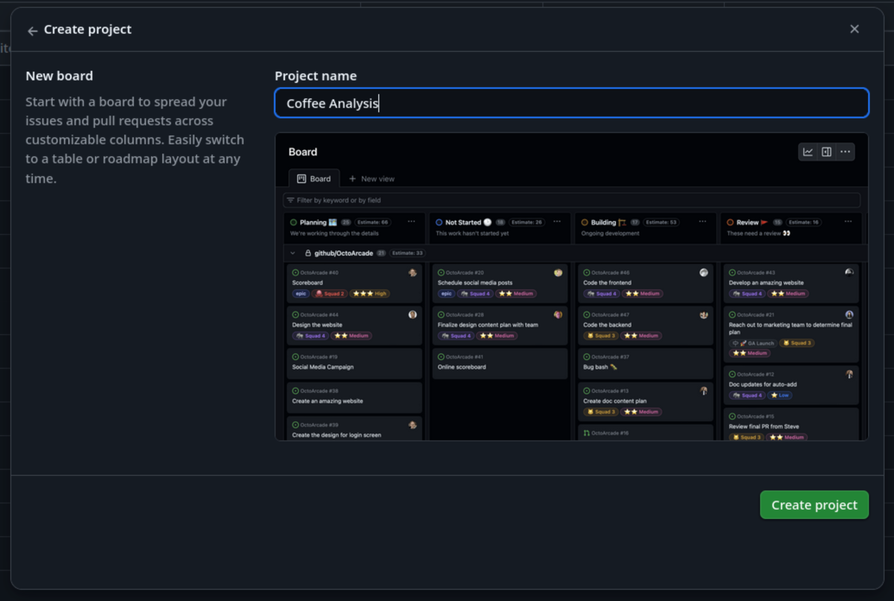
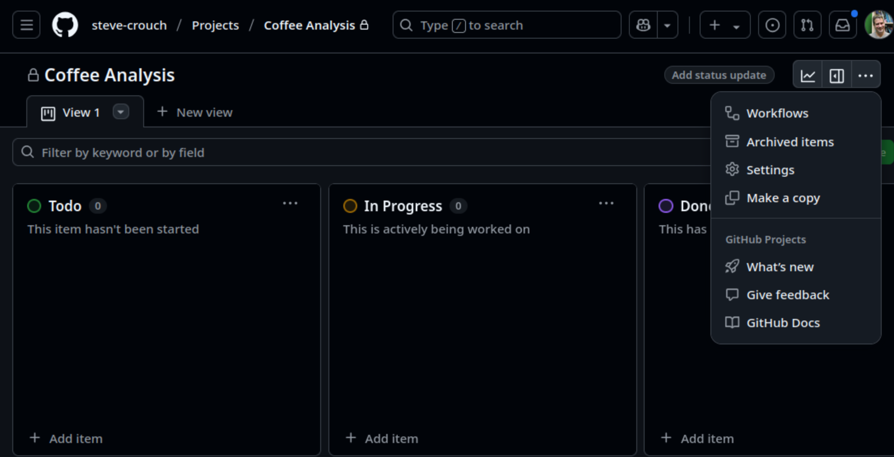
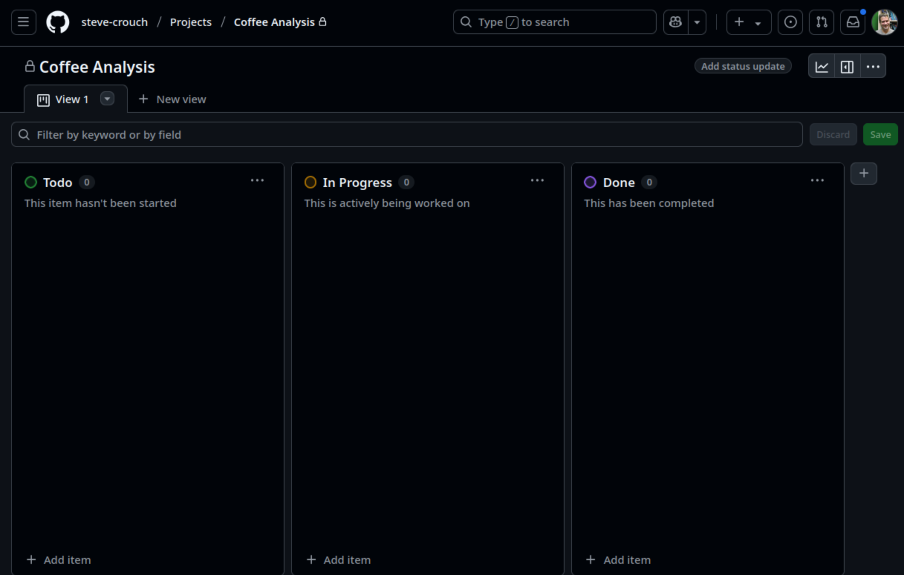
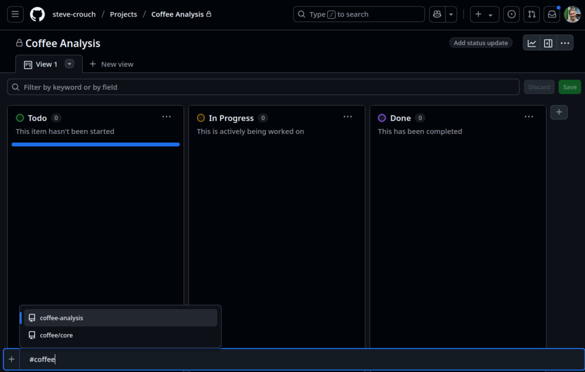
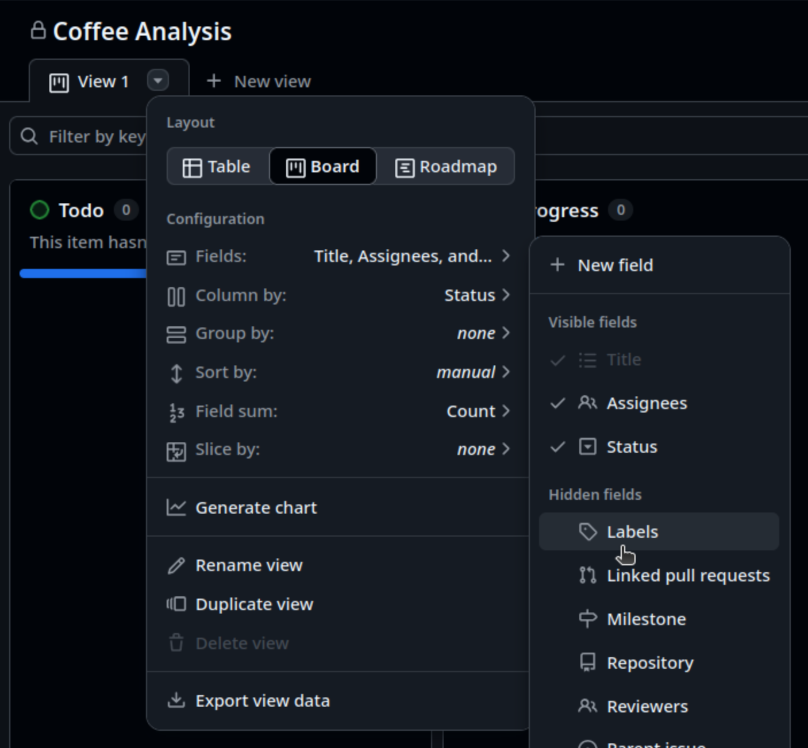

 
:::::::::::::::::::::::::::::::::::::: questions
 
- How should I estimate how long fulfilling a requirement will take?
- How should I prioritise requirements?
- What methods help to clarify requirements with stakeholders?

::::::::::::::::::::::::::::::::::::::::::::::::
 
::::::::::::::::::::::::::::::::::::: objectives
 
- Create a GitHub Project Board to manage issues
- Add backlog items to the Project Board
- Describe the key principles and approaches to estimation
- Apply MoSCoW with a client to prioritise items in a product backlog
- Create questions for clarification needed from the client
- Elicit clarifications and agree on project requirements with client

::::::::::::::::::::::::::::::::::::::::::::::::

## Managing Issues in GitHub

Managing our issues as presented in the `Issues` page is helpful as a view to everything that's being done,
but it gives a relative flat representation of tasks and it's not straightforward to determine,
at a glance, the overall status of a project.
In particular:

- What's still to do
- What's currently in progress
- What's been completed

This is particularly the case when we have many issues for a given project,
and more than one person working on them.

In an agile Scrum sense, if we're currently in a sprint (or preparing for one in a sprint planning session) it would be beneficial to have a way to visualise and manage this information efficiently.
GitHub does provide *Milestones* as an organisational mechanism,
where we are able to group issues together in logical lists, but this approach also has similar limitations at scale.
In addition, a key technique in agile approaches is frequent prioritisation,
and that's difficult to do without a higher-level approach.

### GitHub Projects

GitHub Projects enable ways of organising issues into smaller “sub-projects” (i.e. smaller than the “project” represented by the whole repository).
Projects provide a way of visualising and organising work which is not time-bound and is on a higher level,
which makes management easier.
Milestones are typically used to organise lower-level tasks that have deadlines and progress of which needs to be closely tracked (e.g. release and version management). The main difference is that Milestones are a repository-level feature (i.e. they belong and are managed from a single repository), whereas projects are account-level and can manage tasks across many repositories under the same user or organisational account.

Conceptually, for our purposes a GitHub Project is a "project board",
which originated as a tool used by Toyota in the 1940s called the "Kanban" system.
Kanban-style boards consists of columns and cards to keep track of tasks.
You break down your project into smaller sub-projects,
which in turn are split into tasks which you write on cards,
then move the cards between columns that describe the status of each task.
Cards are usually small, descriptive and self-contained tasks that build on each other.
Breaking a project down into clearly-defined tasks makes it a lot easier to manage.

In GitHub, a project board adopts this Kanban-style,
with entries on the board either being:

- *Cards* - a short note which belongs only to the Project Board
- *Issues* - essentially GitHub issues imported from a repository (or many repositories)

As well as a Kanban-style boards, GitHub Projects also supports other types of view too,
including roadmap views, table-based views, or as a spreadsheet.
For the purposes of this training, we'll use the boards view.

### Creating a Board for our Project

:::::::::::::::::::::::::::::::::::::::  challenge

## Group Exercise: Create a Project Board

5 mins.

To use a project board in GitHub, it needs to be created and shared with the rest of the group.

Firstly, select one of the team to create the board, who will:

1. On the group repository's main page, select `Projects`, then `New Project`.
1. In the `Create Project` pop-up window, we are presented with some styles to choose from: `Table`, `Board` and `Roadmap`. Select `Board`.
1. Decide and enter a name for the board, `Coffee Analysis` for example:
  {alt='Create a project board in GitHub' .image-with-shadow width="1000px"}

Similarly to how the repository was shared with the rest of the group,
the project board also needs to be shared:

1. Select the `...` in the top right and select `Settings:
  {alt='Access settings for a project board' .image-with-shadow width="1000px"}
1. Select `Manage access` from the navigation bar on the left.
1. Under `Invite collaborators`, add each member of the group by adding their username.
1. Set each member's permissions under `Manage access` to `Write` or `Admin` so they are able to make changes to the board.

::::::::::::::::::::::::::::::::::::::::::::::::::

Once created, you should see the default layout for a GitHub board,
with three columns: `Todo`, `In Progress`, and `Done`,
into which we import repository issues,
and manage them.

{alt='Layout of a typical project board' .image-with-shadow width="1000px"}

:::::::::::::::::::::::::::::::::::::::::  callout

## Adapting our Board Columns...

You can add or remove columns from your project board to suit your use case.
One commonly seen extra column is `On hold` or `Waiting`.
If you have tasks that get held up by waiting on other people (e.g. to respond to your questions) then moving them to a separate column makes their current state clearer.

::::::::::::::::::::::::::::::::::::::::::::::::::

### Importing Issues

In order to manage our repository's issues, we need to first add them to our board.

If you select `+ Add item` at the bottom of the `Todo` column,
you'll be able to enter some text.
If you continue to add arbitrary text, this will create a board card,
but instead, we want to add issues from our repository.
To do this, type `#` followed by your repository name, e.g. `#coffee-analysis`.

{alt='Adding an issue to a GitHub project board' .image-with-shadow width="1000px"}

This will present a short list of repositories that match that name (hopefully just the one!).
Select the repository and you should see a list of issues appear from which you are able to select to add to the board (although don't do this just yet!)

:::::::::::::::::::::::::::::::::::::::  challenge

## Group Exercise: Add our Project Backlog Issues to the Board

5 mins.

In your groups each add at least one repository issue to the `Todo` column in the project board until they have all been added.
Ensure that everyone gets a chance to add at least one issue!

You may see that the added issues don't display their labels by default.
This is particularly useful, so to do that:

1. Select the drop down next to `View 1` (a down pointing arrow)
1. Select `Fields`, then select `Labels` from the `Hidden fields`
1. Select `Save` on the pop=up that appears

{alt='Display labels on board issues' .image-with-shadow width="1000px"}

The assigned labels for each issue should now be visible.

::::::::::::::::::::::::::::::::::::::::::::::::::

## Estimation: the Foundation for Prioritisation

Once we have an initial set of requirements captured,
we need to understand their importance in relation to each other:
essentially we need to prioritise them.

But before we can prioritise our requirements,
there are some things we need to find out.

Firstly, we need to know:

- *The period of time we have to resolve these requirements* -
  e.g. before the next software release, pivotal demonstration,
  or other deadlines requiring their completion.
  This is known as a **timebox**.
  This might be a week or two, but for agile, this should not be longer than a month.
  Longer deadlines with more complex requirements may be split into a number of timeboxes.
- *How much overall effort we have available* -
  i.e. who will be involved and how much of their time we will have during this period.

We also need estimates for how long each requirement will take to resolve,
since it's difficult to meaningfully prioritise requirements without
knowing what the effort tradeoffs will be.
Even if we know how important each requirement is,
how would we even know if completing the project is possible?
Or if we do not know how long it will take
to deliver those requirements we deem to be critical to the success of a project,
how can we know if we can include other less important ones?

It is often not the reality in practice,
but estimation should ideally be done by the people likely to do the actual work:
the developers themselves.
It shouldn't be done by project managers or those otherwise not involved in development,
simply because they are not best placed to estimate,
and those doing the work are the ones who are effectively committing to these figures.
As well as lacking the inherent technical skills required to estimate,
having senior non-development roles dictating estimates is that they are at risk of non-development biases such as idealised project timelines and goals which may not be achievable.

### T-Shirt Estimation

One method typically used in agile for estimation is *t-shirt estimation*.
Instead of applying specific estimates of time to complete each requirement or task,
you instead assign a t-shirt size to each in order to estimate their size *relative to each other*.
T-shirt estimation is a far simpler method that emphasises simplicity, speed, and collaboration
in early stages of a project where details are often vague.

Some example sizes might be:

| Size | Description | Rough time estimate |
|----- |-------------|---------------------|
| XS | Very quick and easy | < 1 day  |
| S  | Small effort        | 1-2 days |
| M  | Medium effort       | 2-4 days |
| L  | Large effort        | 5-7 days |
| XL | Very large or unclear | - |

So for any tasks judged to be `XL`,
this implies it needs to be clarified and/or broken down into further tasks.

:::::::::::::::::::::::::::::::::::::::  challenge

## Solo Exercise: T-Shirt Estimate!

Apply a t-shirt size estimation to each of the following requirements:

FIXME: add example requirements

::::::::::::::::::::::::::::::::::::::::::::::::::

:::::::::::::::::::::::::::::::::::::::::  callout

## Why is it so Difficult to Estimate?

Estimation is a very valuable skill to learn, and one that is often difficult.
Lack of experience in estimation can play a part,
but a number of psychological causes can also contribute.
One of these is [Dunning-Kruger](https://en.wikipedia.org/wiki/Dunning%E2%80%93Kruger_effect),
a type of cognitive bias in which people tend to overestimate their abilities,
whilst in opposition to this is [imposter syndrome](https://en.wikipedia.org/wiki/Impostor_syndrome),
where due to a lack of confidence people underestimate their abilities.
The key message here is to be honest about what you can do,
and find out as much information that is reasonably appropriate before arriving at an estimate.

More experience in estimation will also help to reduce these effects.
So keep estimating!

::::::::::::::::::::::::::::::::::::::::::::::::::

An effective way of helping to make your estimates more accurate is to do it as a team.
Other members can ask prudent questions that may not have been considered,
and bring in other sanity checks and their own development experience.
Just talking things through can help uncover other complexities and pitfalls,
and raise crucial questions to clarify ambiguities.

:::::::::::::::::::::::::::::::::::::::  challenge

## Solo Exercise: Apply T-shirt Estimates to your Product Backlog

5 mins.

On your own, quickly apply the t-shirt estimation technique to the issues in your product backlog,
noting down your estimates.
Use the following categories, which have a greatly reduced time scale:

| Size | Description | Rough time estimate |
|----- |-------------|---------------------|
| XS | Very quick and easy | < 5 mins  |
| S  | Small effort        | 5-10 mins |
| M  | Medium effort       | 10-20 mins |
| L  | Large effort        | 1 hour |
| XL | Very large or unclear | - |

::::::::::::::::::::::::::::::::::::::::::::::::::

:::::::::::::::::::::::::::::::::::::::  challenge

## Group Exercise: Collate your Estimates!

As a group, reveal all your individual estimates  - which may be wildly different! -
for each of the requirements and decide the final size based on the majority size.
For those that have equal votes, decide quickly as a group on the final size.

Once you have a list of final sizes,
add each agreed size as a comment to its corresponding issue in your product backlog.

::::::::::::::::::::::::::::::::::::::::::::::::::

:::::::::::::::::::::::::::::::::::::::: callout

## General Tips for a Successful Estimation Session

- Avoid mapping sizes to exact hours/days too early
- Focus on relative sizing between stories
- Discuss outliers - why does someone see it as an XL when others see M?
- Use the discussion to uncover unknowns or assumptions about the requirements,
and clarify them in the product backlog

::::::::::::::::::::::::::::::::::::::::::::::::

## Prioritisation

FIXME: when to prioritise? essentially at a number of levels within the project

Now we have our estimates we can decide
how important each requirement is to the success of the project.
This should be decided by the project stakeholders;
those - or their representatives -
who have a stake in the success of the project
and are either directly affected or affected by the project,
e.g. clients,
end-users,
collaborators,
etc.

To prioritise these requirements we can use a method called **MoSCoW**,
a way to reach a common understanding with stakeholders
on the importance of successfully delivering each requirement for a timebox.
MoSCoW is an acronym that stands for
**Must have**,
**Should have**,
**Could have**,
and **Won't have**.
Each requirement is discussed by the stakeholder group and falls into one of these categories:

- *Must Have* (MH) -
  these requirements are critical to the current timebox for it to succeed.
  Even the inability to deliver just one of these would
  cause the project to be considered a failure.
- *Should Have* (SH) -
  these are important requirements but not *necessary* for delivery in the timebox.
  They may be as *important* as Must Haves,
  but there may be other ways to achieve them
  or perhaps they can be held back for a future development timebox.
- *Could Have* (CH) -
  these are desirable but not necessary,
  and each of these will be included in this timebox if it can be achieved.
- *Won't Have* (WH) -
  these are agreed to be out of scope,
  perhaps because they are the least important or not critical for this phase of development.

In typical use, the ratio to aim for of requirements to the MH/SH/CH categories is
60%/20%/20% for a particular timebox.
Importantly, the division is by the requirement *estimates*,
not by number of requirements,
so 60% means 60% of the overall estimated effort for requirements are Must Haves.

Why is this important?
Because it gives you a unique degree of control of your project for each time period.
It awards you 40% of flexibility with allocating your effort
depending on what's critical and how things progress.
This effectively forces a tradeoff between the effort available and critical objectives,
maintaining a significant safety margin.
The idea is that as a project progresses,
even if it becomes clear that you are only able to
deliver the Must Haves for a particular time period,
you have still delivered it *successfully*.

:::::::::::::::::::::::::::::::::::::::  challenge

## Group Exercise: Prioritise our Product Backlog

15 mins.

In this exercise you'll be prioritising the issues/backlog items according to a MoSCoW approach.

Firstly, have someone in the group add some additional custom labels to the repository,
one each for the MoSCoW classifications, e.g.:

- `MH` for `Must Have`
- `SH` for `Should Have`
- `CH` for `Could Have`
- `WH` for `Won't Have`

Once added, as a group, go through each the backlog items and taking into account the time estimates for each, decide what level of priority to assign to them.
Try to assign a 60%/20%/20% balance of `MH`/`SH`/`CH` across the issues.
For the purposes of this training exercise, assume there is only a total of 1.5 hours available for the project
(which may mean, depending on your estimates, that some things won't make the cut!)

::::::::::::::::::::::::::::::::::::::::::::::::::

:::::::::::::::::::::::::::::::::::::: keypoints
 
- FIXME
 
::::::::::::::::::::::::::::::::::::::::::::::::
