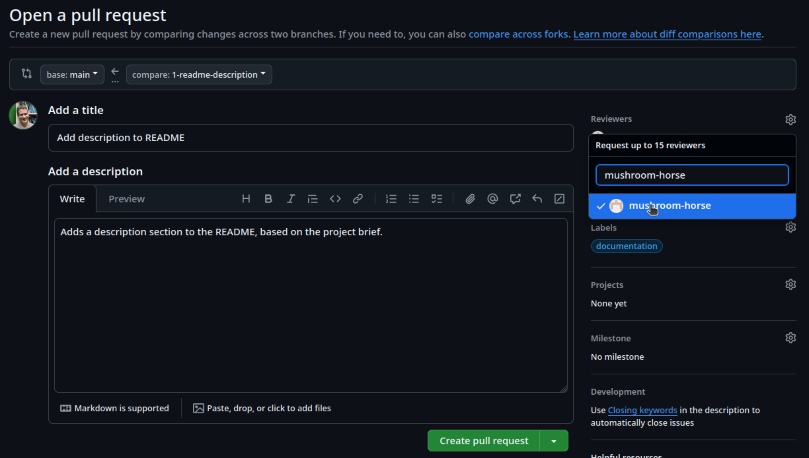
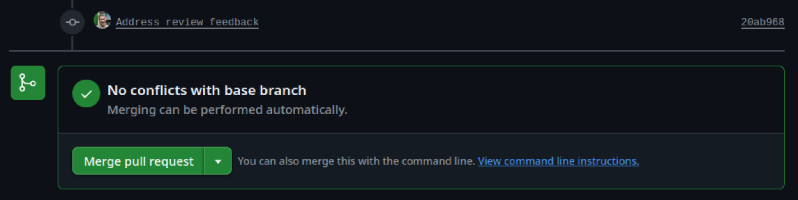

 
:::::::::::::::::::::::::::::::::::::: questions
 
- FIXME
 
::::::::::::::::::::::::::::::::::::::::::::::::
 
::::::::::::::::::::::::::::::::::::: objectives

- Define a pull request and identify some reasons for using pull requests
- Bullet-point some advantages and limitations of working in a feature-branch workflow
- Submit a pull request in GitHub
- Review a pull request
 
::::::::::::::::::::::::::::::::::::::::::::::::

## Pull Requests and Code Reviews

So far we've looked at different ways we can work on separate strands of development in branches and then merge them.
Since they are independent, it's sometimes difficult to know what the overall effect will be when they are finally merged.

In our previous exercise we focused on writing code in an individual setting on feature branches.
However if we allowed everyone to develop and merge code whenever, wherever, and however they wanted,
without any kind of coordination,
the result would likely be a chaotic and potentially non-functional mess.
Using feature branches helps to some extent,
keeping strands of development separate
but in many cases, when it comes time to merge our branch into the `main` branch,
it would be really useful to have a way to *review* code before it's finally merged to verify that these changes are well considered and implemented.

Fortunately version control hosting infrastructures like GitHub support an additional step in the use of feature branches, the *pull request*:
the changes in a feature branch are proposed in a pull request,
and then the pull request is reviewed by another team member (or maybe several).
If the pull request is judged to be a suitable set of changes,
the pull request is accepted and the changes are merged using a branch merging strategy as discussed.

{alt="Diagram depicting a feature branch being created off of a main branch, with its own commits, and those commits then being merged onto the main branch."}

However, if the review identifies issues that indicate that it is unsuitable to be merged,
the pull request is rejected.
This does not necessarily mean the pull request has to be closed.
Development on the feature branch of that pull request may continue,
with further commits to address the points brought up in the review,
and then the pull request reviewed again at a later time and perhaps accepted and merged.

{alt="Diagram depicting a failed first review of a pull request, subsequent fixes to address the review, and a successful second review and merge to main."}

In a sense, a pull request is a verification check - or insurance policy - against merging bad commits to the `main` branch.

This approach is known as *feature branch workflow*.

### Preparing Some Example Work

In order for us to try out feature branch workflow as a team,
let's first create some issues on our group repository to represent some small tasks we'll do using that approach.

:::::::::::::::::::::::::::::::::::::::  challenge

## Group Exercise: Make Work for Yourselves!

5 mins.

The group repository contains a draft README with a typical set of section headings that should be added:

- *Description* - what are the motivations for the software, the problem it aims to solve, and its key functions?
- *Pre-requisites* - what software or other dependencies are required to use this software?
- *Installation* - how do you install or deploy the software so it can be used?
- *Usage* - what are a basic set of instructions for using the software for its intended purpose?
- *Running Tests* - how do you run the automated unit tests?
- *Authors/Maintainers* - who are the authors and maintainers of the software? e.g. including yourselves, and your contact information?
- *Licence* - what is the licence for the software?
- *Acknowledgements* - what other projects, software or people should be acknowledged as part of this work?

As a group:

1. Select a number of sections equal to the number of members in your group,
and divide them up so everyone gets a section to write
1. For each member select someone else who will review their pull request - make a note of this for later!
1. Each member then creates an issue on the group repository describing the task of writing that section,
ensuring the issue has a sufficient description,
has a `Documentation` label set,
and is assigned to that member.

::::::::::::::::::::::::::::: solution

For example:

{alt="Adding a new GitHub issue to the group repository for writing a description to the README, ensuring it has a quick summary, is assigned to someone, and has a documentation label"}

::::::::::::::::::::::::::::::::::::::

::::::::::::::::::::::::::::::::::::::::::::::::::

Next, based on your assigned task,
we'll use feature branch workflow on our cloned group repository.

Ensure you have a terminal open,
and you're currently in the root directory of your group repository.

1. First, create a new branch for that issue, referencing the issue number in the branch name, e.g. `git branch 123-readme-description`
1. Switch to that branch, e.g. `git switch 123-readme-description`
1. Use a code editor to edit the `README.md` file and very briefly write content for that section as per your assigned issue
1. Intentionally introduce a spelling mistake or other smaller issue into the text, and save the file
1. Add the changes to the Git staging area, e.g. `git add README.md`
1. Commit the changes, referencing the issue number in the commit message prefixed with a `#` symbol, e.g. `git commit -m "#123 - Add description"`
1. Push the changes to the remote group repository, e.g. `git push -u origin 123-readme-description`

If you go to the repository's main branches page (e.g. https://github.com/github-username/coffee-analysis/branches) you should see your new branch listed,
and eventually those of your other team members.

### Submitting a Pull Request

Let's each create a pull request now, based on our changes.

1. First, go the `Pull requests` tab at the top of the group repository main page,
and select `New pull request`
1. In the `Compare changes` page that comes up:
     {alt="Comparing changes between feature and main branches to create a pull request, showing the commits to merge and the line-by-line changes between files"}
   - Select `compare:` and select your new branch, e.g. `123-readme-description`
   You should now see a summary of the changes between the new branch and the `main` branch,
   i.e. a single commit and the new README content you pushed earlier
   - Select `Create pull request`

1. In the `Open a pull request` page that appears:
     {alt="Add details for pull request before creating it, including a reviewer, label, title, and description"}
   - Enter a fitting title, brief description, and label
   - Select `Reviewers` and add the GitHub account for the other group member who will review your pull request
   - Select `Create pull request`

You'll then see a summary of the pull request,
including a summary of any conflicts with the base (`main`) branch, of which there should be none.
There's also an option to merge the pull request - but don't do this yet,
since you'll need to wait for your pull request to be reviewed!

Interestingly, even though we have created this PR to do a merge,
we could continue developing our code on this new branch indefinitely if we wanted.
We could make and push new commits to this branch, which would show up here,
and we then merge at a future date.
This may be particularly useful if we need to have a longer discussion about the PR as it is developing.
The discussion would be captured in the comments for the PR,
and when ready, we then merge the PR.

:::::::::::::::::::::::::::::::::::::::::  callout

## How Long should PRs be Open?

Which raises the question, of how long should PRs be open, or branches for that matter?
To some degree, this depends on the nature of the changes being made
But branches in Git are designed, and should be wherever possible, short-lived and deleted when no longer required.
The longer a branch is open, the more potential changes could be made to the main branch.
Then when it comes time to merge the branch, we may get a lot of conflicts we need to manage.
So generally, it's a good idea to keep your branches open for a day or two, a few days maximum, before creating a PR and doing a merge if you can.
Note that we can also see this PR,
as well as any others, by selecting the `Pull request` tab.

::::::::::::::::::::::::::::::::::::::::::::::::::

### Reviewing Code

Next, you'll be reviewing someone else's pull request from your group,
so let's look at that pull request:

1. Go to the `Pull requests` page on the group repository
1. Select the pull request from the other member who you've been assigned to review

This will present an overview of the pull request (PR),
including on separate tabs:

- `Conversation` - an overview of the PR, including comments and other activities associated with the PR,
as well as a summary at the end, indicating the overall status in terms of reviews requested, and whether there are any merge conflicts with the base branch (`main` in this case)
- `Commits` - a list of all commits on the feature branch that have yet to be merged into the base branch
- `Checks` - whether there are any automated checks implemented in GitHub Actions and their status
- `Files changed` - the list of files and their line-by-line changes for this PR

If you select the `Files changed` tab,
of if you select `Add your review` from the `Conversation` page which takes you to the same tab,
you can then begin your review.

By default, the presented view indicates a "unified" view.

{alt="Unified view of file changes for a pull request"}

This shows deletions highlighted in red,
and additions highlighted in green.

Another view is the "split" view of these changes,
which is selectable by clicking on the cog-like icon and selecting `Split`:

{alt="Split view of file changes for a pull request"}

This provides a side-by-side alternative,
with the older version on the left, and the newer version on the right.
In this case, you should see a number of green highlighted lines on the right side of this view,
indicating the added lines.

When providing a review, we have the option of adding comments or suggestions inline to the proposed changes.
By hovering over a line and selecting the ‘+’ symbol at the start of the line,
we're able to add a comment on that line,
for example if we spotted a spelling or grammatical mistake,
or in the case of code, a programmatic problem or other issue.

:::::::::::::::::::::::::::::::::::::::  challenge

## Solo Exercise: Conduct a Review of Your Assigned PR!

5 mins.

Briefly review the content added by your colleague for their assigned section,
and if you identify an issue,
add comments for content on a particular line using `+`,
adding a comment,
and selecting `Start a review`.
Feel free to add other comments as necessary.

{alt="Add a comment to a pull request"}

When you've completed your review,
select `Finish your review`,
leave an overall comment on your thoughts about the PR,
and select one of:

- `Comment` - where you're just leaving a comment and aren't requesting any changes
- `Approve` - no comments are changes are necessary
- `Request changes` - feedback must be addressed before it can be merged

Finally, select `Submit review`.

{alt="Final comments and recommendation for the PR"}

::::::::::::::::::::::::::::::::::::::::::::::::::

### Addressing Feedback

As owner of your PR, the next step involves addressing any feedback made by the reviewer.
Return to the PR you created earlier,
and take a look at the comments that will appear in the `Conversation` tab.
You may need to scroll down to see them.

{alt="Observe review feedback in the conversayions tab"}

:::::::::::::::::::::::::::::::::::::::  challenge

## Solo Exercise: Address your Colleague's Feedback

5 mins.

Address the feedback provided by your reviewer,
by making changes in your editor to `README.md`,
saving the file and re-committing it to the repository,
and pushing the changes.
e.g. after editing `README.md`:

```bash
git add README.md
git commit -m "Address review feedback"
git push
```

::::::::::::::::::::::::::::::::::::::::::::::::::

### Merging the Pull Request

With the review feedback addressed,
we are now ready to merge the pull request to the `main` branch.
The bottom of the `Conversation` tab will show a `Merge pull request` button,
and a summary of whether there is a conflict with the base branch:

{alt="Merge pull request option, visible at the bottom of the conversations tab"}

Selecting the drop-down will present you with a number of options for how to perform the merge,
which includes the merge options discussed previously -
create a merge commit, squash and merge, and rebase and merge.
Ensure this `Create a merge commit` is selected for now.

Finally, select `Merge pull request` to complete the merge.

:::::::::::::::::::::::::::::::::::::: keypoints
 
- FIXME
 
::::::::::::::::::::::::::::::::::::::::::::::::
