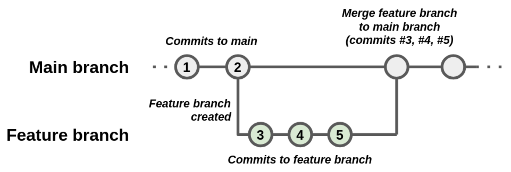

 
:::::::::::::::::::::::::::::::::::::: questions
 
- FIXME
 
::::::::::::::::::::::::::::::::::::::::::::::::
 
::::::::::::::::::::::::::::::::::::: objectives

- Describe how workflow relates to process
- Describe the purpose of branches in a repository
- Define the elements of a feature-branch workflow
- Describe four major strategies for merging branches
- Bullet-point some advantages and limitations of working in a feature-branch workflow
- Verify that team is able to developing using project repository locally
- Create and use a branch
- Define a pull request and identify some reasons for using pull requests
- Submit a pull request in GitHub
- Review a pull request
- Resolve a small conflict between two branches
 
::::::::::::::::::::::::::::::::::::::::::::::::

## How are a Development Process and Version Control Related?

FIXME: how the use of infrastructure should reflect and support how the team operates
FIXME: the reality of simultaneous strands of development in a project
FIXME: the main branch, the need for multiple branches

:::::::::::::::::::::::::::::::::::::::  challenge

## Solo Exercise: Set up SSH Keypair for use with GitHub

5 mins.

In order to access GitHub using Git from your machine securely,
you need to set up a way of authenticating yourself with GitHub through Git.
The recommended way to do that for this course is to set up
[*SSH authentication*](https://www.ssh.com/academy/ssh/public-key-authentication) -
a method of authentication that is more secure than sending
[*passwords over HTTPS*](https://security.stackexchange.com/questions/110415/is-it-ok-to-send-plain-text-password-over-https)
and which requires a pair of keys -
one public that you upload to your GitHub account, and one private that remains on your machine.

GitHub provides full documentation and guides on how to:

- [Generate an SSH key](https://docs.github.com/en/authentication/connecting-to-github-with-ssh/generating-a-new-ssh-key-and-adding-it-to-the-ssh-agent)
- [Add an SSH key to a GitHub account](https://docs.github.com/en/authentication/connecting-to-github-with-ssh/adding-a-new-ssh-key-to-your-github-account).

To generate an SSH key pair, you will need to run the `ssh-keygen` command from your command line tool/GitBash
and provide **your identity for the key pair** (e.g. the email address you used to register with GitHub)
via the `-C` parameter as shown below.
Note that the `ssh-keygen` command can be run with different parameters -
e.g. to select a specific public key algorithm and key length;
if you do not use them `ssh-keygen` will generate an
[RSA](https://en.wikipedia.org/wiki/RSA_\(cryptosystem\)#:~:text=RSA%20involves%20a%20public%20key,by%20using%20the%20private%20key.)
key pair for you by default.
GitHub now recommends that you use a newer cryptographic standard (such as [EdDSA](https://en.wikipedia.org/wiki/EdDSA) variant algorithm [Ed25519](https://cryptobook.nakov.com/digital-signatures/eddsa-and-ed25519)),
so please be sure to specify it using the `-t` flag as shown below.
It will also prompt you to answer a few questions -
e.g. where to save the keys on your machine and a passphrase to use to protect your private key.
Pressing 'Enter' on these prompts will get `ssh-keygen` to use the default key location (within
`.ssh` folder in your home directory)
and set the passphrase to empty.

```bash
ssh-keygen -t ed25519 -C "your-github-email@example.com"
```

```output
Generating public/private ed25519 key pair.
Enter file in which to save the key (/Users/<YOUR_USERNAME>/.ssh/id_ed25519): 
Enter passphrase (empty for no passphrase): 
Enter same passphrase again: 
Your identification has been saved in /Users/<YOUR_USERNAME>/.ssh/id_ed25519
Your public key has been saved in /Users/<YOUR_USERNAME>/.ssh/id_ed25519.pub
The key fingerprint is:
SHA256:qjhN/iO42nnYmlpink2UTzaJpP8084yx6L2iQkVKdHk your-github-email@example.com
The key's randomart image is:
+--[ED25519 256]--+
|.. ..            |
| ..o A           |
|. o..            |
| .o.o .          |
| ..+ =  B        |
| .o = ..         |
|o..X *.          |
|++B=@.X          |
|+*XOoOo+         |
+----[SHA256]-----+
```

Next, you need to copy your public key (**not your private key - this is important!**) over to
your GitHub account. The `ssh-keygen` command above will let you know where your public key is saved (the file should have the
extension ".pub"), and you can get its contents (e.g. on a Mac OS system) as follows:

```bash
cat /Users/<YOUR_USERNAME>/.ssh/id_ed25519.pub
```

```output
ssh-ed25519 AABAC3NzaC1lZDI1NTE5AAAAICWGVRsl/pZsxx85QHLwSgJWyfMB1L8RCkEvYNkP4mZC your-github-email@example.com
```

Copy the line of output that starts with "ssh-ed25519" and ends with your email address
(it may start with a different algorithm name based on which one you used to generate the key pair
and it may have gone over multiple lines if your command line window is not wide enough).

Finally, go to your [GitHub Settings -> SSH and GPG keys -> Add New](https://github.com/settings/ssh/new) page to add a new
SSH public key. Give your key a memorable name (e.g. the name of the computer you are working on that contains the
private key counterpart), paste the public key
from your clipboard into the box labelled "Key" (making sure it does not contain any line breaks), then click the "Add SSH key" button.

Now, we can check that the SSH connection is working:

```bash
ssh -T git@github.com
```

::::::::::::::::::::::::::::::::::::::::::::::::::

## Introduction to Feature Branches

You might be used to committing code directly, but not sure what branches really are or why they matter?
When you start a new Git repository and begin committing,
all changes go into a branch — by default, this is usually called `main` (or `master` in older repositories).
The name "main" is just a convention — a Git repository’s default branch can technically be named anything.

So why not just always use the main branch?
While it is possible to always commit to `main`, it is not ideal when you’re collaborating with others,
or when you are working on new features or want to experiment with your code and you want to keep main clean and stable for your users and collaborators.

Creating and working on a separate branch, often called a “feature” branch,
allows developers to "branch off" development from a particular commit in the repository,
enabling them to make changes (as new commits) to a branch without disrupting the `main` branch.
When this separate development has been tested and is judged to be ready,
the commits on this branch are then merged into the `main` branch.

{alt="Diagram depicting a feature branch being created off of a main branch, with its own commits, and those commits then being merged onto the main branch."}

You should consider starting a new branch whenever you are working on a distinct feature or fixing a specific bug.

## Check we can Use the Group Repository

To verify we are able to use the group's `coffee-analysis` repository,
we'll each clone the repository on our own machines,
create a unique branch and make some commits to it,
and push the new branch to the remote repository.

1. Clone the group's repository on your machine, and change directory to it (replacing `github-username` with the username of the user who created the repository)

   ```bash
   git clone git@github.com:github-username/coffee-analysis
   cd coffee-analysis
   ```

1. Create a new branch and switch to it (replacing `unique-branch-name` with a unique name of your choice)

    ```bash
    git branch unique-branch-name
    git switch unique-branch-name
    ```

1. Edit the `README.md` file in an editor of your choice,
make a small change to it (anything will do),
and save the file.

1. Commit the change to the repository on your local machine

    ```bash
    git add README.md
    git commit -m "A trivial change" README.md
    ```

1. Push the commit to the remote repository

    ```bash
    git push -u origin unique-branch-name
    ```

    Hopefully, you should see this command complete without errors,
    which will verify you are able to push commits on new branches to the repository.

1. Since it's no longer needed, go to the group repository's list of branches (e.g. https://github.com/github-username/coffee-analysis/branches) and delete the branch you just created by clicking on the dustbin/trash icon on its row on the right (be careful not to delete any others!).

:::::::::::::::::::::::::::::::::::::::  challenge

## Group Exercise: Pros and Cons of Using Feature Branches

5 mins.

As a group, discuss how a feature branch workflow affects how code is developed,
and list some advantages and disadvantages of such an approach when used in a team.

:::::::::::::::  solution

Advantages:

- It enables the main branch to remain stable while you and the team explore and test the new code on a feature branch
- It enables you to keep the untested and not-yet-functional feature branch code under version control and backed up
- You and other team members may work on several features at the same time independently from one another
- If you decide that the feature is not working or is no longer needed - you can easily and safely discard that branch without affecting the rest of the code

Disadvantages:

- Requires that the team understand this approach and how to use it in an agreed and consistent manner
- Can become complicated if you need to use features available on another branch in your own branch
- Long-lived branches may become too divergent from the `main` branch, complicating the process of merging changes from such branches
- Similarly, implementing and then merging multiple feature branches simultaneously becomes exponentially more difficult
- If `main` contains many changes not in the feature branches, all feature branches may diverge [fixme]

:::::::::::::::::::::::::

::::::::::::::::::::::::::::::::::::::::::::::::::

## Branch Merging Strategies

When you are ready to bring the changes from your feature branch back into the main branch, Git offers you to do a merge - a process that unifies work done in 2 separate branches. 
Git will take two (or more - you can merge more branches at the same time) commit pointers and attempt to find a common base commit between them. 
Git has several different methods of finding the base commit - these methods are called "merge strategies". Once Git finds the common base commit it will create a new "merge commit" that combines the changes of the specified merge commits. Technically, a merge commit is a regular commit which just happens to have two parent commits.

Each merge strategy is suited for a different scenario. The choice of strategy depends on the complexity of changes and the desired outcome. Let's have a look at the most commonly used merge strategies.

### Fast Forward Merge

A fast-forward merge occurs when the main branch has not diverged from the feature branch - meaning there are no new commits on the main branch since the feature branch was created. 

```text
A - B - C [main]
         \
          D - E [feature]
```

In this case, Git simply moves the main branch pointer to the latest commit in the feature branch. This strategy is simple and keeps the commit history linear - i.e. the history is one straight line.

After a fast forward merge:

```text
A - B - C - D - E [main][feature]
```

### 3-Way Merge with Merge Commit

A fast-forward merge is not possible if the main and the feature branches have diverged. 

```text
A - B - C - F [main]
         \
          D - E [feature]
```

If you try to merge your feature branch changes into the main branch and other changes have been made to main - regardless of whether these changes create a conflict or not - Git will try to do a 3-way merge and generate a merge commit. 

A merge commit is a dedicated special commit that records the combined changes from both branches and has two parent commits, preserving the history of both lines of development. The name "3-way merge" comes from the fact that Git uses three commits to generate the merge commit - the two branch tips and their common ancestor to reconstruct the changes that are to be merged.

```text
A - B - C - F - "MergeCommitG" [main]
         \     /
          D - E [feature]
```

In addition, if the two branches you are trying to merge both changed the same part of the same file, Git will not be able to figure out which version to use and merge automatically.
When such a situation occurs, it stops right before the merge commit so that you can resolve the conflicts manually before continuing.
	
### Rebase & Merge

In Git, there is another way to integrate changes from one branch into another: the rebase.

Let's go back to an earlier example from the 3-way merge, where main and feature branches have diverged with subsequent commits made on each (so fast-forward merging strategy is not an option).

```text
A - B - C - F [main]
         \
          D - E [feature]
```

When you rebase the feature branch with the main branch, Git replays each commit from the feature branch on top of all the commits from the main branch in order. This results in a cleaner, linear history that looks as if the feature branch was started from the latest commit on main. 

So, all the changes introduced on feature branch (commits D and E) are reapplied on top of commit F - becoming D' and E'. Note that D' and E' are rebased commits, which are actually new commits with different SHAs but the same modifications as commits D and E.

```text
A - B - C - F [main]
             \
              D' - E' [feature]
```

At this point, you can go back to the main branch and do a fast-forward merge with feature branch.

Fast forward merge strategy is best used when you have a short-lived feature branch that needs to be merged back into the main branch, and no other changes have been made to the main branch in the meantime.

Rebase is ideal for feature branches that have fallen behind the main development line and need updating. It is particularly useful before merging long-running feature branches to ensure they apply cleanly on top of the main branch.
Rebasing maintains a linear history and avoids merge commits (like fast forwarding), making it look as if changes were made sequentially and as if you created your feature branch from a different point in the repository's history. 
A disadvantage is that it rewrites commit history, which can be problematic for shared branches as it requires force pushing.

### Squash & Merge

Squash and merge squashes all the commits from a feature branch into a single commit before merging into the main branch. This strategy simplifies the commit history, making it easier to follow.
This strategy is ideal for merging feature branches with numerous small commits, resulting in a cleaner main branch history. 

```text
A - B - C - F - "SquashCommitG" [main]
         \
          D - E [feature]
```

Note that unlike the 3-way merge, `SquashCommitG` only has one parent, `F`,
so does not preserve the link to the commits on the feature branch upon which `SquashCommitG` is based.
This has caused some to consider squash commits harmful,
since that part of the commit history is lost.
For this reason, squash commits are handy when you want to clean up a commit history from a short-lived feature branch prior to merging to `main`,
but problematic with longer lived branches or when maintaining commit history is important.

FIXME: verify squash commit has only 1 parent when using a squash-merged PR

## Summary

Here is a little comparison of the three merge strategies we have covered so far.

|                   | Fast Forward            | Rebasing              | 3-Way Merge          | Squash Merge    |
|-------------------| ----------------------- | ----------------------|----------------------|-----------------|
| History           | Maintains linear history  |  Maintains linear history | Non-linear history (commit with 2 parents) | Linear history (commit with 1 parent) |
| Effect on main    | No new commits on main | New commits on main | New commits on main | One new commit on main |
| Merge commit?     | Avoids merge commits         | Avoids merge commits | Uses merge commits | Avoids merge commits |
| When it works     | Only works if there are no new commits on the main branch        | Works for diverging branches | Works for diverging branches | Works for diverging branches |
| Rewrites history? | Does not rewrite commit history | Rewrites commit history | Does not rewrite commit history | Does not rewrite commit history |

FIXME: callout

FIXME: challenge - which approach suits your use of version control in most cases? and scenarios for when to and when not to squash merge: twenty people giving many commits to a single feature branch (i.e. want to keep history), simple changes that need to revert (i.e. changing colours back and forth, or testing)


## Pull Requests and Code Reviews

So far we've looked at different ways we can work on separate strands of development in branches and then merge them.
Since they are independent, it's sometimes difficult to know what the overall effect will be when they are finally merged.

:::::::::::::::::::::::::::::::::::::::  challenge

## Group Exercise: What are the Risks?

5 mins.

In general, as a group discuss what you think the risks are with developing and merging code using branches in a team environment.

::::::::::::::::::::::: solution

Here are several non-exhaustive reasons:

- The merge may introduce errors that cause the software to break or fundamentally change its behaviour in ways that are unintended but not immediately obvious
- There may be a variability in the quality or style of written code that leads to bugs or readability issues
- Team members may not be aware of important changes being made in other branches that will affect their work
- Work may be unknowingly duplicated, or introduce conflicting solutions, e.g. where there are logical overlaps between coding tasks in different branches
- The reasoning behind changes may be unclear
- A suboptimal approach may be taken for which another team member has a better solution

:::::::::::::::::::::::::::::::::

::::::::::::::::::::::::::::::::::::::::::::::::::

In our previous exercise we focused on writing code in an individual setting on feature branches.
However if we allowed everyone to develop and merge code whenever, wherever, and however they wanted,
without any kind of coordination,
the result would likely be a chaotic and potentially non-functional mess.
Using feature branches helps to some extent,
keeping strands of development separate
but in many cases, when it comes time to merge our branch into the `main` branch,
it would be really useful to have a way to *review* code before it's finally merged to verify that these changes are well considered and implemented.

Fortunately version control hosting infrastructures like GitHub support an additional step in the use of feature branches, the *pull request*:
the changes in a feature branch are proposed in a pull request,
and then the pull request is reviewed by another team member (or maybe several).
If the pull request is judged to be a suitable set of changes,
the pull request is accepted and the changes are merged using a branch merging strategy as discussed.

{alt="Diagram depicting a feature branch being created off of a main branch, with its own commits, and those commits then being merged onto the main branch."}

However, if the review identifies issues that mean that it is unsuitable to be merged,
the pull request is rejected.
This does not necessarily mean the pull request has to be closed,
and development on the feature branch of that pull request may continue,
addressing the points brought up in the review,
and then the pull request reviewed at a later time and perhaps accepted and merged.

In a sense, a pull request is a verification check - or insurance policy - against merging bad commits to the `main` branch.

This approach is known as *feature branch workflow*.

:::::::::::::::::::::::::::::::::::::::  challenge

## Group Exercise: Make Work for Yourselves

5 mins.

The group repository contains a draft README with a typical set of section headings that should be added:

- *Description* - what are the motivations for the software, the problem it aims to solve, and its key functions?
- *Pre-requisites* - what software or other dependencies are required to use this software?
- *Installation* - how do you install or deploy the software so it can be used?
- *Usage* - what are a basic set of instructions for using the software for its intended purpose?
- *Running Tests* - how do you run the automated unit tests?
- *Authors/Maintainers* - who are the authors and maintainers of the software? e.g. including yourselves, and your contact information?
- *Licence* - what is the licence for the software?
- *Acknowledgements* - what other projects, software or people should be acknowledged as part of this work?

As a group:

1. Select a number of sections equal to the number of members in your group,
and divide them up so everyone gets a section
1. Each member then creates an issue on the group repository describing the task of writing that section,
ensuring the issue has a sufficient description,
has a `Documentation` label set,
and is assigned to that member.

::::::::::::::::::::::::::::::::::::::::::::::::::

::::::::::::::::::::::::::::: solution

For example:

{alt="Adding a new GitHub issue to the group repository for writing a description to the README, ensuring it has a quick summary, is assigned to someone, and has a documentation label"}

::::::::::::::::::::::::::::::::::::::

:::::::::::::::::::::::::::::::::::::::  challenge

## Solo Exercise: Try out Feature Branch Workflow

15 mins.

Individually, based on your assigned task,
use feature branch workflow on your cloned group repository to:

1. Create a new branch for that issue, referencing the issue number in the branch name, e.g. `git branch 123-readme-description`
1. Switch to that branch, e.g. `git switch 123-readme-description`
1. Use a code editor to edit the `README.md` file and very briefly write content for that section, and save the file
1. Add the changes to the Git staging area, e.g. `git add README.md`
1. Commit the changes, referencing the issue number in the commit message prefixed with a `#` symbol, e.g. `git commit -m "#123 - Add description"`
1. Push the changes to the remote group repository, e.g. `git push -u origin 123-readme-description`

If you go to the repository's main branches page (e.g. https://github.com/github-username/coffee-analysis/branches) you should see your new branch listed,
and eventually those of your other team members.

::::::::::::::::::::::::::::::::::::::::::::::::::

### Submitting a Pull Request

Let's each create a pull request now, based on our changes.


### Reviewing Code

### Merging the Pull Request


:::::::::::::::::::::::::::::::::::::: keypoints
 
- FIXME
 
::::::::::::::::::::::::::::::::::::::::::::::::
