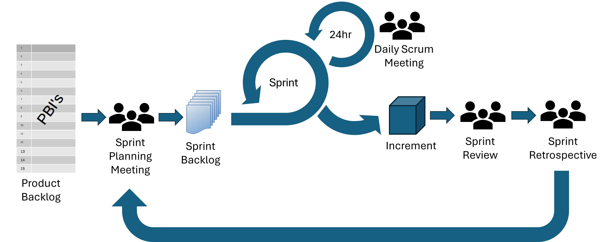
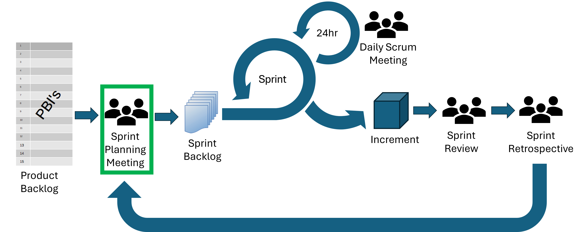
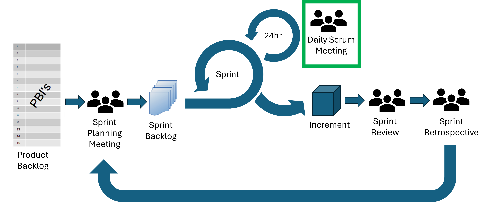
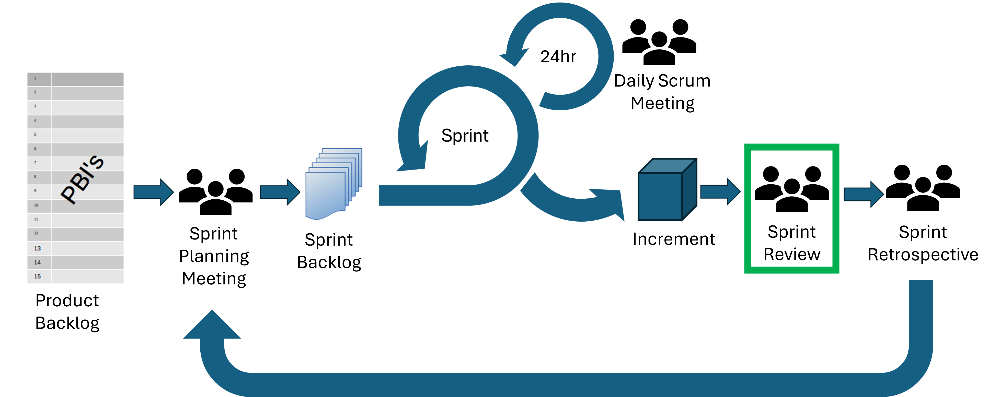
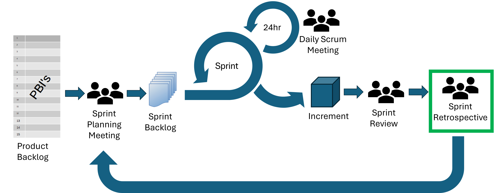

::: questions
-   FIXME
:::

::: objectives
-   Describe the primary artifacts and stages within Scrum and how they relate as a process
-   Outline the key steps to a sprint planning meeting
-   Outline the key steps to a scrum stand-up meeting
-   Participate in a sprint planning meeting to create a sprint backlog
-   Describe the purpose, objectives and format of the main Scrum meetings
:::

# Events of a Sprint

{alt='diagram of scrum events and artifacts'}

A Sprint in Scrum is a fixed-length event, usually between one week and one month in length.
All work that is needed to achieve the Product Goal is contained within Sprints.

There are four Scrum Events within a Sprint:

-   Sprint Planning Meeting
-   Daily Scrum Meeting
-   Sprint Review
-   Sprint Retrospective

All of the Scrum Events are designed to enable transparency and to give formal opportunities to inspect and adapt Scrum artifacts. 

::: callout
In relation to the diagram in the previous section, Scrum Events can be thought of as part of the temple roof.  Scrum Events need to be supported by the Scrum principles, values and pillars to work successfully.
:::

## Sprint Planning Meeting

{alt='diagram of scrum events and artifacts with sprint planning highlighted'}

The Sprint Planning Meeting is the kickoff meeting for the Sprint.
During this meeting the Scrum Team will decide what's most important, how much can realistically get done, and how you'll make it happen.

The Product Owner, Scrum Master and Developers all attend the Sprint Planning meeting.
Other people may also be invited to attend to provide advice.

Sprint Planning needs to answer three questions:

1.  **Why is this Sprint valuable?**
    -   The Product Owner explains how this Sprint will add value. For example, what improvements or new features will benefit the users.
    -   Based on this, the Scrum Team collaboratively decides on the Sprint Goal, which should be a single, unifying goal for the Sprint.
    -   The Sprint Goal must be finalised before the end of the Sprint Planning Meeting.
2.  **What can be Done this Sprint?**
    -   Next, the Developers work with the Product Owner to select the highest-priority Product Backlog items that they feel confident they can complete. This might involve refining or breaking down the items to make sure the whole Scrum Team knows what's involved.
    -   Estimating the amount of work that will fit into one Sprint can be difficult but basing the estimates on past performance, upcoming capacity and the Definition of Done can improve the accuracy of estimates.
3.  **How will the chosen work get done?**
    -   For each item selected from the Product Backlog, the Developers plan the specific tasks needed to turn ideas into a working Increment.
    -   Often, Developers will break large items into smaller, more manageable chunks that will take one day or less.
    -   The Developers decide how to do the work. The Developers are in charge of this, no one else can tell them how to build the solution.
    -   The Sprint Goal, the Product Backlog items selected for the Sprint, and the plan for delivering them are collectively referred to as the Sprint Backlog.

A Sprint Planning Meeting should be an absolute maximum of eight hours for a one month Sprint, and should be shorter for shorter Sprints.
Time-boxing the meeting keeps the discussion focussed and allows the Scrum Team to start making delivering value fast.

:::: challenge
## Group Challenge: Puppy Playdate Planner

Read the following scenario about the Puppy Playdate Planner app and discuss the questions at the end.

**Sprint Planning Meeting Scenario**

Imagine your Scrum Team is working on the Puppy Playdate Planner app.
The Product Goal is: “Help puppy owners connect and organise playdates easily.”

During Sprint Planning, the team agreed on this Sprint Goal: “Enable creation of puppy profiles and the functionality to search for nearby puppies.”

They selected these Product Backlog items for the Sprint:

-   Puppy profiles (breed, age, personality, photo upload)
-   Location-based search for nearby puppy owners
-   Basic UI for profile creation and search results

The Developers planned these tasks:

-   Design user interface wireframes and mockups
-   Develop backend APIs for profiles and search
-   Implement photo upload and location filtering
-   Write unit and integration tests
-   Conduct peer reviews and usability testing

The Scrum Master noticed that the team did not discuss messaging or playdate scheduling features and expressed concern that the Product Owner hadn’t clarified their priority or timing.

Some Developers were unsure how much work they could complete due to unfamiliarity with the photo upload and location technologies.

The Scrum Master reminded the team to consider the Definition of Done and ensure the Increment would be fully integrated and tested.

**Questions:**

**1. Which aspects of the Sprint Planning Meeting went well?**

**2. Which aspects of the Sprint Planning Meeting could be improved?**

::: solution
**1. What aspects of the Sprint Planning went well?**

-   Clear Sprint Goal aligned with the Product Goal.
-   Thoughtful breakdown of Product Backlog items into concrete tasks.
-   Inclusion of testing and peer reviews highlights focus on quality.
-   Scrum Master emphasised the Definition of Done, reinforcing standards.
-   Open discussion of team capacity and challenges with new technologies.

**2. What aspects of this Sprint Planning Meeting could be improved?**

-   Discuss important features that will be developed in later sprints, such as messaging and scheduling, to make sure that they can be integrated into the current work.
-   Check with the product owner on feature prioritisation and roadmap.
-   Plan to manage risks related to unfamiliar technologies.
-   Discuss dependencies for each task to make sure no developer is likely to become blocked.
-   Form a mitigation strategy for uncertainties in capacity estimation.
-   Express the Sprint Goal in terms of user outcomes, instead of focusing on features, for example: *“Allow puppy owners to create profiles and easily find playdate partners nearby to start connecting.”*

:::
::::

## Daily Scrum Meeting

{alt='diagram of scrum events and artifacts with daily meeting highlighted'}

The Scrum Team meet each day to inspect progress toward the Sprint Goal, adapt the Sprint Backlog and adjust plans for upcoming work.

The Daily Scrum isn’t just a status update, it helps the Scrum Team:

-   See progress toward the Sprint Goal
-   Surface and solve problems faster
-   Make quick decisions
-   Reduce the need for additional meetings
-   Keep momentum going with clear next steps

This meeting should usually last no longer than 15 minutes and is usually held in the same time and place every working day of the Sprint.  The Daily Scrum can take any structure and use any techniques as long as it focuses on progress toward the Sprint Goal and produces a plan for the next day of work.

Usually each developer would cover:
-   What you did yesterday
-   What you plan to do today
-   Anything that's blocking you

During a Daily Scrum Meeting, focus on exchanging information with others in the group not just talking about what you've been doing.  

The Daily Scrum Meeting isn't the only time that Developers can discuss and adjust their plans.
Developers can also meet throughout the day to re-adjust plans or to have more detailed discussions.

:::: challenge

## Group Challenge: Exchange and Unblock

In this challenge, you're going to practice conducting a Daily Scrum Meeting in groups of four. 

Assign one person to the Scrum Master role, they are responsible for keeping the meeting to time and ensuring everyone get a chance to say everything they need to.  The whole meeting must be under five minutes long. 

Assign the three other group members to developer roles: Developer 1, Developer 2, or Developer 3.  

Each developer should read the information under their section below but none of the others.  This information may be important to others in the Scrum Team.

During the meeting, the developers should exchange information so that all developers end the meeting with no blockers, a clear plan for their day and are aware of any dependencies or issues.

::: solution

Useful information exchanged and possible outcomes from the meeting:

-   Developer 1 learns that Developer 2 has created the API endpoint that they need and that it's likely to be ready later today.  
-   Developer 3 could take some of the user interface element tasks from Developer 1 (if they have the relevant skills).
-   Developer 2 plans some co-working time with the developer(s) working on the user interface elements. 
-   Developer 2 understands that the calculation tests are currently expected to fail due to the updated calculation implemented by Developer 3.
-   Developer 3 might look at the sprint backlog and see which tasks they could take.

:::

::::

::: spoiler
## Developer 1

-   I'm planning to develop a user interface for viewing user information from our app.  However, I can see that the API endpoint for fetching user information isn't complete yet.  Any idea when that will be ready? This is a high priority task.
-   Today I've also planned to create user interface components for the registration, login, and admin dashboard. These are lower priority tasks.
-   I have more tasks than I can realistically get through today.

:::

::: spoiler
## Developer 2

-   Yesterday I developed an API endpoint for fetching user information.  I need to check this passes all relevant tests and will merge later today if so. 
-   I'm planning work on changing the method of authentication for our app to make it more secure for users but I want to make sure that this doesn't break the front-end of the app.  How can we make sure that doesn't happen?
-  I noticed that some of the tests related to the calculations are failing, does anyone know why this is?

:::

::: spoiler
## Developer 3

-   Yesterday I changed one of the calculations in the app (as was planned for this Sprint), the test is based on the old calculation and is expected to now fail, I need to update the test to reflect the calculation change. 
-   I don't think I have enough tasks to fill my day - can anyone suggest what I should work on next?

:::

## Sprint Review

{alt='diagram of scrum events and artifacts with sprint review highlighted'}

The Sprint Review is where the Scrum Team and stakeholders inspect the work completed during the Sprint and discuss what to do next.

It’s a chance to show progress, gather feedback, and adapt the Product Backlog if needed. 

The Sprint Review may take the form of a demonstration and discussion, but it should be a working session, not just a presentation.

The Sprint Review:

-   Is held at the end of the Sprint
-   Focuses on how the Increment moves the product toward the Product Goal
-   Aims to enable collaboration between the Scrum Team and stakeholders of the product.

## Sprint Retrospective

{alt='diagram of scrum events and artifacts with sprint retrospective highlighted'}

The Sprint Retrospective is a reflective session for the Scrum Team only to inspect what went well and what could be improved from the previous Sprint.

The Sprint Retrospective:

-   Is the last event of the Sprint - held after the Sprint Review but before the next Sprint Planning Meeting.
-   Focuses on inspection of team collaboration, tools, processes and anything else that affected the Sprint to identify any changes that can improve effectiveness. 
-   Addresses any assumptions that led the team away from the Product Goal and determines where they came from. 

We'll go into more detail about the Sprint Review and Sprint Retrospective after you've conducted your first Sprint.

# Sprint Planning for the Coffee Beans Analysis Project

Now, it's time to put all of this theory into practice and conduct a Sprint Planning Meeting for the first Sprint of the Coffee Beans Analysis Project.  

::: challenge

## Group Challenge: Sprint Planning for Coffee Beans Analysis

Conduct the Sprint Planning Meeting for Sprint 1 of the Coffee Beans Analysis Project.

**Roles**

-   One person should be Scrum Master.  You are the servant leader who helps the group apply Scrum effectively, removes blockers and improves flow for the Scrum Team.
-   One person should role play as the Product Owner.  You should represent the interests of the client throughout the meeting.
-   The rest of the group should be developers.  The Scrum Master and acting Product Owner can also be developers.

**Questions for Sprint Planning**

Remember to answer the following questions during the Sprint Planning Meeting:

-   Why is this Sprint valuable?
-   What can be Done this Sprint?
-   How will the chosen work get Done?

The output from your Sprint Planning Meeting should be your Sprint Backlog including:
-   A Sprint Goal
-   The subset of items from the Product Backlog that you will work on this Sprint
-   A plan for delivering the Increment by the end of the Sprint

:::

::: keypoints
-   FIXME
:::
