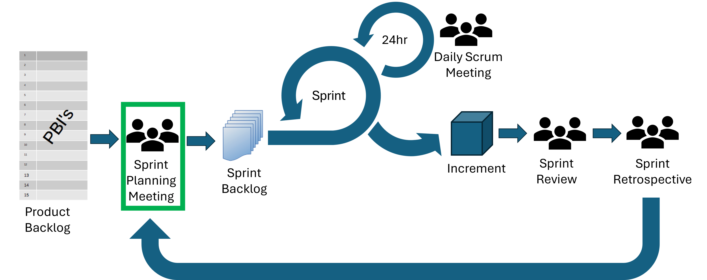
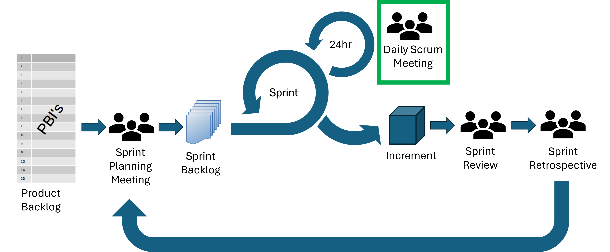

::: questions
-   What three questions would you ask during a Sprint Planning Meeting?
-   What should be the outcome of a Sprint Planning Meeting?
-   What are the three main points that a developer would cover during the Daily Scrum Meeting?
-   
:::

::: objectives
-   Outline the key steps to a Sprint Planning Meeting
-   Outline the key steps to a Daily Scrum Meeting
-   Describe the purpose, objectives and format of the main Scrum meetings
-   Participate in a Sprint Planning Meeting to create a Sprint Backlog
:::

# Events of a Sprint

A Sprint in Scrum is a fixed-length event, usually between one week and one month in length.
All work that is needed to achieve the Product Goal is contained within Sprints.

There are four Scrum Events within a Sprint:

-   Sprint Planning Meeting
-   Daily Scrum Meeting
-   Sprint Review
-   Sprint Retrospective

All of the Scrum Events are designed to enable transparency and to give formal opportunities to inspect and adapt Scrum artifacts. 

::: callout
In relation to the diagram in the previous section, Scrum Events can be thought of as part of the temple roof.  Scrum Events need to be supported by the Scrum principles, values and pillars to work successfully.
:::

## Sprint Planning Meeting

{alt='diagram of scrum events and artifacts with sprint planning highlighted'}

The Sprint Planning Meeting is the kickoff meeting for the Sprint.
During this meeting the Scrum Team will decide what's most important, how much can realistically get done, and how you'll make it happen.

The Product Owner, Scrum Master and Developers all attend the Sprint Planning meeting.
Other people may also be invited to attend to provide advice.

Sprint Planning needs to answer three questions:

1.  **Why is this Sprint valuable?**
    -   The Product Owner explains how this Sprint will add value. For example, what improvements or new features will benefit the users.
    -   Based on this, the Scrum Team collaboratively decides on the Sprint Goal, which should be a single, unifying goal for the Sprint.
    -   The Sprint Goal must be finalised before the end of the Sprint Planning Meeting.
2.  **What can be Done this Sprint?**
    -   Next, the Developers work with the Product Owner to select the highest-priority Product Backlog items that they feel confident they can complete. This might involve refining or breaking down the items to make sure the whole Scrum Team knows what's involved.
    -   Estimating the amount of work that will fit into one Sprint can be difficult but basing the estimates on past performance, upcoming capacity and the Definition of Done can improve the accuracy of estimates.
3.  **How will the chosen work get done?**
    -   For each item selected from the Product Backlog, the Developers plan the specific tasks needed to turn ideas into a working Increment.
    -   Often, Developers will break large items into smaller, more manageable chunks that will take one day or less.
    -   The Developers decide how to do the work. The Developers are in charge of this, no one else can tell them how to build the solution.
    
The output from your Sprint Planning Meeting should be your Sprint Backlog including:

-   A Sprint Goal
-   The subset of items from the Product Backlog that you will work on this Sprint
-   A plan for delivering the Increment by the end of the Sprint

A Sprint Planning Meeting should be an absolute maximum of eight hours for a one month Sprint, and should be shorter for shorter Sprints.
Time-boxing the meeting keeps the discussion focussed and allows the Scrum Team to start making delivering value fast.

:::: challenge
## Group Exercise: Coffee Shop App

5 mins

Read the scenario and discuss the questions with your group.

Scenario: 

A Scrum Team is building an app so customers can order coffee ahead of pickup.

During Sprint Planning, the team agreed on this Sprint Goal: "Let customers order their coffee before arriving at the shop."

They selected one Product Backlog item for the Sprint: "Customers can build an order and pay in the app."

The Developers broke this into three tasks:

- Build the menu and "add to order" screen
- Add a payment step
- Test the full ordering flow

While planning, one Developer mentioned they'd never built a payment feature before and weren't sure how long it would take. The team moved on without addressing this.

Questions:

- What are some potential issues with how this was handled?
- What could the team have done instead?

::: solution

**What are some potential issues with how this was handled?**

- Time estimates may be unreliable if the developer has no experience with payment feature. 
- It's better to make a plan for potential issues during the Sprint Planning Meeting rather than when the actual issue arises.
- The developer will likely feel uncertain and unsupported at the start of the Sprint. 
- If a Developer raises a concern and it's brushed past, they may be less likely to speak up next time.

**What could the team have done instead?**

- Pause and discuss it there and then
- Break the payment task down further, separating a research task (time-boxed investigation) from the actual build, so the unknown is isolated rather than baked into one big estimate.
- Pair the unfamiliar Developer with someone who has relevant experience, or bring in outside help/documentation review as part of the plan.
- **Adjust the plan or scope if the risk is significant e.g., agree that if the payment step turns out to be too complex, the team will de-scope to "menu and order building only" this Sprint and add payment next Sprint.
- Note it as a risk to watch, even if the team decides to proceed as planned so that the whole team (especially the Scrum Master) can watch for signs of trouble early rather than being surprised later.
:::

::::

## Daily Scrum Meeting

{alt='diagram of scrum events and artifacts with daily meeting highlighted'}

The Scrum Team meet each day to inspect progress toward the Sprint Goal, adapt the Sprint Backlog and adjust plans for upcoming work.

The Daily Scrum Meeting helps the Scrum Team:

-   See progress toward the Sprint Goal
-   Surface and solve problems faster
-   Make quick decisions
-   Reduce the need for additional meetings
-   Keep momentum going with clear next steps

This meeting should usually last no longer than 15 minutes and is usually held in the same time and place every working day of the Sprint.  The Daily Scrum can take any structure and use any techniques as long as it focuses on progress toward the Sprint Goal and produces a plan for the next day of work.

Usually each developer would cover:

-   What you did yesterday
-   What you plan to do today
-   Anything that's blocking you

During a Daily Scrum Meeting, focus on exchanging information with others in the group not just talking about what you've been doing.  

The Daily Scrum Meeting isn't the only time that Developers can discuss and adjust their plans.
Developers can also meet throughout the day to re-adjust plans or to have more detailed discussions.

:::: challenge

## Group Exercise: Exchange and Unblock

10 mins.

In this challenge, you're going to practice conducting a Daily Scrum Meeting in groups of four. 

Assign one person to the Scrum Master role, they are responsible for keeping the meeting to time and ensuring everyone get a chance to say everything they need to.  The whole meeting must be under five minutes long. 

Assign the three other group members to developer roles: Developer 1, Developer 2, or Developer 3.  

Each developer should read the information under their section below but none of the others.  This information may be important to others in the Scrum Team.

During the meeting, the developers should exchange information so that all developers end the meeting with no blockers, a clear plan for their day and are aware of any dependencies or issues.

::: solution

Useful information exchanged and possible outcomes from the meeting:

-   Developer 1 learns that Developer 2 has created the API endpoint that they need and that it's likely to be ready later today.  
-   Developer 3 could take some of the user interface element tasks from Developer 1 (if they have the relevant skills).
-   Developer 2 plans some co-working time with the developer(s) working on the user interface elements. 
-   Developer 2 understands that the calculation tests are currently expected to fail due to the updated calculation implemented by Developer 3.
-   Developer 3 might look at the sprint backlog and see which tasks they could take.

:::

::::

::: spoiler
## Developer 1

-   I'm planning to develop a user interface for viewing user information from our app.  However, I can see that the API endpoint for fetching user information isn't complete yet.  Any idea when that will be ready? This is a high priority task.
-   Today I've also planned to create user interface components for the registration, login, and admin dashboard. These are lower priority tasks.
-   I have more tasks than I can realistically get through today.

:::

::: spoiler
## Developer 2

-   Yesterday I developed an API endpoint for fetching user information.  I need to check this passes all relevant tests and will merge later today if so. 
-   I'm planning work on changing the method of authentication for our app to make it more secure for users but I want to make sure that this doesn't break the front-end of the app.  How can we make sure that doesn't happen?
-  I noticed that some of the tests related to the calculations are failing, does anyone know why this is?

:::

::: spoiler
## Developer 3

-   Yesterday I changed one of the calculations in the app (as was planned for this Sprint), the test is based on the old calculation and is expected to now fail, I need to update the test to reflect the calculation change. 
-   I don't think I have enough tasks to fill my day - can anyone suggest what I should work on next?

:::

## References

-   [Scrum Guide](https://scrumguides.org/scrum-guide.html)

::: keypoints
-   A Sprint is a fixed-length event in Scrum, usually between one week and one month in length.
-   The four Scrum Events are Sprint Planning Meeting, Daily Scrum Meeting, Sprint Review, and Sprint Retrospective.  
-   Sprint Planning answers: Why is this Sprint valuable? What can be done? How will the work get done?  
-   The outcome from the Sprint Planning Meeting is the Sprint Backlog containing the Sprint Goal, subset of Product Backlog items, and a plan for delivering the Increment. 
-   The Daily Scrum Meeting is a 15-minute meeting for the Scrum Master and Developers to inspect progress, adjust plans, and resolve blockers.  
-   All Scrum Events promote transparency, inspection, and adaptation to improve product and team effectiveness.  
:::
