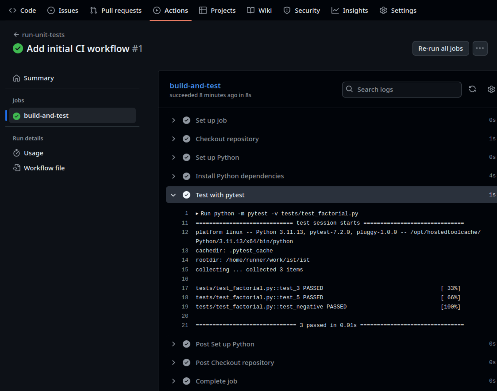

 
:::::::::::::::::::::::::::::::::::::: questions
 
- What is automation in the context of software development, and why is it beneficial?
- How does Continuous Integration (CI) enhance the software development process?
- What tasks can be automated using CI?
- How do I define a CI workflow to automate running a set of unit tests when a change is made to a code repository?
- How do I monitor the progress of a running or completed workflow?
 
::::::::::::::::::::::::::::::::::::::::::::::::
 
::::::::::::::::::::::::::::::::::::: objectives
 
- Understand the concept of automation and its role in improving efficiency and consistency in software development
- Describe the benefits of using Continuous Integration (CI) for further automation of testing
- Use continuous integration to automatically run unit tests when changes are committed to a version control repository
- View the results of running tests automatically using CI

::::::::::::::::::::::::::::::::::::::::::::::::

Doing tasks manually can be time-consuming, error-prone, and hard to reproduce, especially as the software project's complexity grows.
Using automation allows computers to handle repetitive, structured tasks reliably, quickly, and consistently, freeing up your time for more valuable and creative work.

By automating these actions, you save time, reduce the chance of human error, and ensure that processes are reproducible and consistent.
Automation also provides a clear, documented way to understand how things are run, making it easier for others to replicate or build upon your work.

## Introduction to Continuous Integration

Building on the concept of automation, Continuous Integration (CI) is the practice of regularly integrating code changes into a shared code repository and automatically running tasks and key checks each time this happens (e.g. when changes are merged from development or feature branch into main, or even after each commit). This helps maintain code quality and ensures new contributions do not break existing functionality. 

A variety of CI services and tools, like GitHub Actions, GitLab CI, or Jenkins, make it easy to set up automated workflows triggered by code changes. 

CI can also be extended into Continuous Delivery (CD), which automates the release or deployment of code to production or staging environments.

### Principles of CI

Software development typically progresses in incremental steps and requires a significant time investment.
It is not realistic to expect a complete, feature-rich application to emerge from a blank page in a single step.
The process often involves collaboration among multiple developers, especially in larger projects where various components and features are developed concurrently.

Continuous Integration (CI) is based on the principle that software development is an incremental process involving ongoing contributions from one or more developers. 
Integrating large changes is often more complex and error-prone than incorporating smaller, incremental updates.
So, rather than waiting to integrate large, complex changes all at once, CI encourages integrating small updates frequently to check for conflicts and inconsistencies and ensure all parts of the codebase work well together at all times. 
This becomes even more critical for larger projects, where multiple features may be developed in parallel - 
CI helps manage the complexity of merging such contributions by making integrations a regular, manageable part of the workflow.

### Common CI Tasks

CI enables automation of a number of tasks, including:

- Compiling (or otherwise building) code
- Running a test suite across multiple platforms to catch issues early and checking test coverage to see what tests are missing
- Verifying that the code adheres to project, team, or language style guidelines using tools known as code linters
- Building documentation pages from docstrings (structured documentation embedded in the code) or other source pages

These steps are typically executed as part of a structured sequence known as a CI *pipeline* or *workflow*.

While there can be a learning curve when first setting up CI, a wide variety of tools are available, and the core principles are transferable between them, making these valuable and broadly applicable skills.


### CI Services & Tools

There are a wide range of CI-focused workflow services and different tools available to support various aspects of a CI pipeline.
Many of these services have Web-based interfaces and run on cloud infrastructure, providing easy access to scalable, platform-independent pipelines.
However, local and self-hosted options are also available for projects that require more control or need to operate in secure environments.
Most CI tools are generally language- and tool-agnostic; if you can run a task locally, you can likely incorporate it into a CI pipeline. 

Popular cloud-based services that host and run workflows include:

- [GitHub Actions](https://github.com/features/actions)
- [Travis CI](https://www.travis-ci.com/)
- [CircleCI](https://circleci.com/)
- [TeamCity](https://www.jetbrains.com/teamcity/)

While self-hosted or hybrid solutions include:

- [GitLab CI](https://docs.gitlab.com/ee/ci/)
- [Jenkins](https://www.jenkins.io/)
- [Buildbot](https://buildbot.net/)

### Beyond CI - Continuous Deployment/Delivery

You may frequently come across the term CI/CD, which refers to the combination of Continuous Integration (CI) and Continuous Deployment or Delivery (CD). 

Whilst CI focuses on integrating and testing code changes, CD extends the process by automating the delivery and deployment of software. This can include building installation packages for various environments and automatically deploying updates to test or production systems. 
For example, a web application could be redeployed every time a new change passes the CI pipeline (an example is this website - it is rebuilt each time a change is made to one of its [source pages](https://github.com/softwaresaved/byte-sized-rse)). 

CD helps streamline the release process for packages or applications, for example by doing nightly builds and deploying them to a public server for download, making it easier and faster to get working updates into the hands of users with minimal manual intervention.


## Defining a CI Workflow for GitHub Actions

### How to Describe a Github Actions Workflow?

Now before we move on to defining our workflow in GitHub Actions,
we'll take a very brief look at a language used to describe its workflows,
called YAML.

Originally, the acronym stood for *Yet Another Markup Language*,
but since it's not actually used for document markup,
it's acronym meaning was changed to *YAML Aint Markup Language*.

Essentially, YAML is based around key value pairs, for example:

```yaml
name: Kilimanjaro
height_metres: 5892
first_scaled_by: Hans Meyer
```

Now we can also define more complex data structures too.
Using YAML arrays, for example,
we could define more than one entry for `first_scaled_by`,
by replacing it with:

```yaml
first_scaled_by:
  - Hans Meyer
  - Ludwig Purtscheller
```

Note that similarly to languages like Python,
YAML uses spaces for indentation (2 spaces is recommended).
Also, in YAML, arrays are sequences,
where the order is preserved.

There's also a short form for arrays:

```yaml
first_scaled_by: [Hans Meyer, Ludwig Purtscheller]
```

We can also define nested, hierarchical structures too, using YAML *maps*.
For example:

```yaml
name: Kilimanjaro
height:
  value: 5892
  unit: metres
  measured:
    year: 2008
    by: Kilimanjaro 2008 Precise Height Measurement Expedition
```

We are also able to combine maps and arrays,
for example:

```yaml
first_scaled_by:
  - name: Hans Meyer
    date_of_birth: 22-03-1858
    nationality: German
  - name: Ludwig Purtscheller
    date_of_birth: 22-03-1858
    nationality: Austrian
```

So that's a very brief tour of YAML,
which demonstrates what we need to know to write GitHub Actions workflows.

### Enabling Workflows for our Repository

So let's now create a new GitHub Actions CI workflow for our new repository that runs our unit tests whenever a change is made.

Firstly, we should ensure GitHub Actions is enabled for repository.
In a browser:

1. Go the main page for the `industry-skills-testing` repository you created in GitHub.
1. Go to repository `Settings`.
1. From the sidebar on the left select `General`, then `Actions` (and under that, `General`).
1. Under `Actions permissions`, ensure `Allow all actions and reusable workflows` is selected,
otherwise, our workflows won't run!

### Creating Our First Workflow

Next, we need to create a new file in our repository to contain our workflow,
and it needs to be located in a particular directory location,
since GitHub Actions expects workflows to be contained within the `.github/workflows` directory.
Let's create that director and subdirectory now. From the repository root directory:

```bash
mkdir -p .github/workflows
```

Create and edit a new file in this directory called `main.yml`,
which will hold our workflow.

So first let's specify a name for our workflow that will appear under GitHub Actions build reports,
and add the conditions that will trigger the workflow to run:

```yaml
name: run-unit-tests

on: push
```

So here our workflow will run when changes are pushed to the repository.
There are [other events](https://docs.github.com/en/actions/writing-workflows/choosing-when-your-workflow-runs/events-that-trigger-workflows) we might specify instead (or as well) if we wanted,
but this is the most common.

GitHub Actions are described as a sequence of jobs (such as building our code, or running some tests),
and each job contains a sequence of steps
which each represent a specific "action" (such as running a command, or obtaining code from a repository).

Let's define the start of a workflow job we'll name `build-and-test`:

```yaml
jobs:

  build-and-test:

    runs-on: ubuntu-latest
```

We only have one job in this workflow,
but we may have many.
We also specify the operating systems on which we want this job to run.
In this case, only the latest version of Linux Ubuntu,
but we could supply others too (such as Windows, or Mac OS).

When the workflow is triggered,
our job will run within a `runner`,
which you can think of as a freshly installed instance of a machine running the operating system we indicate (in this case Ubuntu).

Let's now supply the concrete things we want to do in our workflow.
We can think of this as the things we need to set up and run on a fresh machine.
So within our workflow, we'll need to:

- Check out our code repository
- Install Python
- Install our Python dependencies (which is just `pytest` in this case)
- Run `pytest` over our set of tests

We can define these as follows:

```yaml
    steps:

    - name: Checkout repository
      uses: actions/checkout@v4

    - name: Set up Python 3.11
      uses: actions/setup-python@v5
      with:
        python-version: "3.11"
```

We first use GitHub Actions (indicated by `uses: actions/`),
which are small tools we use to perform something specific.
In this case, we use:

- `checkout` - to checkout the repository into our runner
- `setup-python` - to set up a specific version of Python

Note that the `name` entries are descriptive text and can be anything,
but it's good to make them meaningful since they are what will appear in our build reports as we'll see later.

```yaml
    - name: Install Python dependencies
      run: |
        python3 -m pip install --upgrade pip
        python3 -m pip install -r requirements.txt

    - name: Test with pytest
      run: |
        python -m pytest -v tests/test_factorial.py
```

Here we use two `run` steps to run some specific commands,
to install our python dependencies and run `pytest` over our tests,
using `-v` to request verbose reporting.

:::::::::::::::::::::::::::::::::::::::::  callout

## What about other Actions?

Our workflow here uses standard GitHub Actions (indicated by `actions/*`).
Beyond the standard set of actions,
others are available via the
[GitHub Marketplace](https://docs.github.com/en/developers/github-marketplace/github-marketplace-overview).
It contains many third-party actions (as well as apps)
that you can use with GitHub for many tasks across many programming languages,
particularly for setting up environments for running tests,
code analysis and other tools,
setting up and using infrastructure (for things like Docker or Amazon's AWS cloud),
or even managing repository issues.
You can even contribute your own.

::::::::::::::::::::::::::::::::::::::::::::::::::

### Adding our Workflow to our Repository

So once we've finished adding in our workflow to the file,
let's commit this into our repository:

```bash
git add .github/workflows/main.yml
git commit -m "Add initial CI workflow"
git push
```

This push action will now trigger the running of this new workflow,
since that's what the workflow is designed to do.


## Checking Workflow Progress

We've committed our workflow,
so how do we know its actually running?
Since the workflow is triggered on each `git push`,
if we go back to our main repository page,
we should see either of the following next to the most recent commit displayed just above the directory contents:

- An orange circle - the CI workflow is currently running
- A green tick - the CI workflow has successfully completed
- A red cross - the CI workflow has failed due to an error

{alt="GitHub repository page indicating a successfully completed workflow run"}

For more detail we can check the progress of a running workflow by selecting `Actions` in the top navigation bar.
This page also shows a historical log of any other previous workflow runs too.

{alt="GitHub list of GitHub Actions"}

We can also view a complete log of the output from workflow runs,
by selecting the first (and only) entry at the top of this list.
This will then display a list of our `job`s (in this case only `build-and-test`).
If we select `build-and-test` we'll see an in-progress log of our workflow run,
separated into separate collapsed steps that we may expand to view further detail.
Each of the steps is named from the `name` labels we gave each step.
Note that the workflow may still be running at this point,
so not all steps may be complete yet.

{alt="Log of finished workflow run"}

If we drill down by selecting the `Test with pytest` entry,
we'll get a breakdown of the thing we're really interested in,
that shows us that our tests were successful!

## Triggering our Workflow with Code Changes

Now if we make a change to our code, our workflow will be triggered and these tests will run,
so let’s make a change.

In GitHub (or on the command line if you prefer),
edit the source code file `mymath/factorial.py`,
add an additional line before `return factorial`.
Then save the file (if editing locally), and commit the change.

If we return to the GitHub Actions workflow list and select the most recent workflow run,
we should see the workflow execute successfully as before - so we know our change hasn't broken anything.

## Summary

Our workflow will now be triggered every time a change to our code is pushed to our GitHub repository,
which means that our code is now always being checked against our tests.
Although we must remember to check the workflow log for this to have value. 
We also need to be sure that our tests sufficiently verify the behaviour of our code as it evolves,
so we should ensure we update our tests as necessary,
and adding new tests as required to verify new functionality.

 
:::::::::::::::::::::::::::::::::::::: keypoints
 
- Automation saves time and improves reproducibility by capturing repeatable processes like testing, linting, and building code into scripts or pipelines
- Continuous Integration (CI) is the practice of automatically running tasks and checks each time code is updated, helping catch issues early and improving collaboration
- Integrating smaller, frequent code updates is more manageable and less error-prone than merging large changes all at once
- CI pipelines can run on many platforms and environments using cloud-based services (e.g. GitHub Actions, Travis CI) or self-hosted solutions (e.g. Jenkins, GitLab CI)
- GitHub Actions workflows are defined using YAML
- A GitHub Actions workflow defines a sequence of jobs, and each job contains a sequence of steps, which each represent a specific "action" or task to perform
- GitHub Actions log the progress of a build which can be viewed in GitHub

::::::::::::::::::::::::::::::::::::::::::::::::
