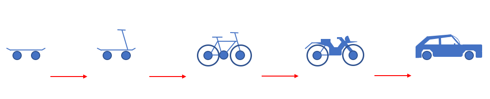

 
:::::::::::::::::::::::::::::::::::::: questions
 
-   How can I communicate technical ideas clearly to non-technical clients?
-   What should I do when the client’s needs or requests are vague or unclear?
-   How do I help the client decide what features to prioritise?
-   How do I manage client expectations around time, budget, and quality?
-   What makes a good client kickoff meeting, and how should I lead it?
-   What should be included in an agenda for a kickoff meeting?
 
::::::::::::::::::::::::::::::::::::::::::::::::
 
::::::::::::::::::::::::::::::::::::: objectives
 
-   Collaborate with clients to refine and prioritise product backlog items.
-   Develop a focused, outcome-driven agenda for a client meeting.
-   Conduct a productive and professional client kickoff meeting.
-   Apply communication and negotiation techniques in a technical context.
::::::::::::::::::::::::::::::::::::::::::::::::

 
# Communicating with Clients

One of the most important skills for a software engineer working in industry is the ability to communicate effectively with clients. At the end of this episode, you will conduct a meeting with one of the helpers who will be role playing as the client for the Coffee Beans Analysis Project. 

Clear communication builds trust, prevents expensive misunderstandings, and ensures that the business goals and technical implementation are aligned.

While this course is focused on software engineering, the points that we'll cover can be applied to any project.

This episode covers three aspects to consider when communicating with clients:

1. Understanding the product and each other
2. Discussing prioritisation
3. Setting realistic expectations

At the end of this episode we will guide you through the process of preparing for the kickoff meeting with the client later this afternoon.

## Understanding the Product and Each Other

{alt='Illustration of two people at a table with laptops'}

**Scenario:**
You’re in a meeting with a client and explain, *“We’re planning to refactor the backend and upgrade the framework so we can implement the auth flow asynchronously. That should make deployments cleaner.”* The client nods politely but later admits they didn’t understand a word. They leave the meeting unclear on what's being done, why it's needed, or how it affects their goals.

This kind of miscommunication is surprisingly common. It stems from the **Expert Awareness Gap** (also known as the Curse of Knowledge), a disconnect between experts and non-experts, where the expert unintentionally assumes that others share their knowledge, context, or mental models, when they do not. This is because experts internalise concepts so deeply that they become automatic and invisible to them.  In this context, software engineers may assume non-technical stakeholders share their understanding of technical concepts that have become second nature. As a result, clients may feel confused, excluded, or unsure how to make informed decisions.

{alt='Lizard jumping across a large gap'}

To bridge this gap, and build shared understanding, try the following techniques:

- **Use analogies or plain language.**  
  For example, instead of saying *“we’re refactoring the code,”* try *“we’re tidying up the code to make it easier and safer to change in the future.”*

- **Expand acronyms even if they seem obvious.**  
  Don’t assume clients know what CI/CD (Continuous Integration / Continuous Deployment), API (Application Programming Interface), or JWT (JSON Web Token) mean.  A good rule is to expand any acronym at least the first time you use it.  

- **Connect technical changes to client value.**  
  For instance, rather than saying *“we’re upgrading the framework,”* say *“we’re upgrading the framework to reduce bugs and give us access to modern features that improve security and performance.”*

- **Frame decisions in terms of the client’s goals.**  
  When discussing trade-offs, explain how technical choices affect things like user experience, compliance, or costs.

- **Use visuals to support understanding.**  
  Diagrams, such as flowcharts, can help convey complex ideas without relying on jargon.

::: challenge

## Pair Exercise: Explain a Technical Topic

7 mins.

Practice overcoming the expert awareness gap by explaining a familiar topic clearly to someone with no background in it.

1. Individually, think of a topic that you know a lot about.  For example, it could be the subject of your research, a programming language or framework that you've used extensively, or a hobby or skill that you have a lot of experience with (e.g. playing the clarinet, wild swimming, golf).

2. Check with your partner that they know little or nothing about this topic.

3. Take two minutes each to explain your topic to your partner as if they have no prior knowledge. 

4. After listening, the partner should ask questions to clarify anything they don't understand. 

5. Swap roles and repeat the exercise so both of you get a chance to explain and to listen.

:::

As well as making sure the client can understand you, you also need to make sure you correctly interpret what the client is saying. 

**Scenario:**
During a planning meeting, a client tells the team: “We want the site to feel modern and fast.” No one asks for clarification. The designers choose a sleek, minimal style with bold colours, and the developers focus on performance optimisations to reduce load times to under 500ms.  However, at the next review, the client is unhappy. By “modern,” they actually meant visually similar to Apple’s aesthetic. And by “fast,” they didn’t mean technical speed, but a user journey with fewer steps. The team now need to rework major parts of the product, wasting both time and budget.

-   **Ask for specifics when things are vague**  
  Use follow-up questions to make abstract requests concrete.  
  *“When you say ‘fast’, do you mean page loads under 1 second, or fewer clicks to reach key information?”*

-   **Probe when clients say, “use your judgement”**  
  If the client doesn’t know exactly what they want, try asking:  
  *“What don’t you want?”* or  
  *“Can you show me an example of something you like or something you don’t like?”*

-   **Summarise and confirm**  
  Restate what you’ve heard to confirm your understanding.  
  *“So just to confirm, you’d like the dashboard to show data from the last 7 days by default?”*

-   **Document everything clearly**  
  Use written follow-ups like email recaps or meeting notes to reinforce shared understanding. These also create a useful reference point.

-   **Admit when you’re unsure**  
  *“I’m not sure I follow, please could you walk me through an example?”*  

Often there will be elements of the project brief that aren't clear to you. 
Ask questions about anything that's not clear so that you have an understanding of the project that matches the client's as closely as possible.

::: challenge
## Group Exercise: Questions about the Coffee Beans Project Brief

15 mins.

Re-read the project brief for the coffee beans project.  

First, individually, take a few minutes to think about what is unclear to you in the project brief and formulate a list of questions for the client.

Then, discuss your questions as a group and form a combined list of all your questions.
:::

## Discussing Prioritisation

**Scenario:**
A client approaches your team with a vision for a meal-planning app. They want ingredients shopping integration, dietary preference tracking, AI-generated recipes, video tutorials, and a sleek mobile interface, all delivered within eight weeks. The client insists each feature is essential. Without clear prioritisation, the team attempts to build everything and ends up delivering an unstable app that fails to meet user expectations. The client is disappointed, and trust is damaged.

This kind of situation is common. Clients are often enthusiastic and ambitious, but may not understand the trade-offs involved. 

There’s rarely enough time or budget to build every requested feature. Prioritisation helps focus resources on what truly matters, ensuring that:

-   The product can launch on time.
-   Key user needs are met early.
-   The team can iterate and improve based on real feedback.

{alt='two people arranging sticky notes on a board'}

### Tools for Prioritisation: MoSCoW

As we introduced earlier, you can use the **MoSCoW method** to help clients prioritise features:

- **Must haves** – Essential for the product to function.
- **Should haves** – Important, but not critical for launch.
- **Could haves** – Desirable extras, only if time allows.
- **Won’t haves (for now)** – Deferred until a later phase.

### The Minimum Viable Product (MVP)

Introducing the concept of the **Minimum Viable Product (MVP)** can help clients to prioritise by thinking about what’s essential first.

The **MVP** is a basic, working version of the product that delivers the product's core value. It's not the final product, but it’s enough to test with users and validate the idea.

For instance, imagine that the client wants you to build a car.  The core value is a structure with wheels that can get you from A to B, so the MVP might be a skateboard.

{alt='diagram of a car mvp'}

## Setting Realistic Expectations

**Scenario:**
In a client meeting, a developer says, *"Yes, we should be able to add that feature by the end of the sprint."* The client is pleased.  However, a week later, it becomes clear that the feature is more complex than expected, other tasks are behind schedule, and the team now has to explain the delay. The client feels frustrated and blindsided and this impacts the trust they have in your development team.

This is a classic example of unrealistic expectations, often caused by optimism, pressure to please, or fear of disappointing the client in the moment.

Setting realistic expectations is one of the most important parts of client communication. It helps prevent misunderstandings, reduces stress, and builds long-term trust.

{alt='man with laptop gesturing'}

- **Under-promise, over-deliver**  
  Clients would rather be pleasantly surprised than disappointed. Estimate conservatively, it's better to deliver something early or with extra polish than to miss a deadline.

- **Build in contingency time**  
  Always allow for the unexpected. Think carefully about what could go wrong (technical complexity, team availability, integration issues), and factor that into your estimates.

- **Avoid committing on the spot**  
  Don’t feel pressured to promise something immediately. It's entirely professional to say:  
  *“Let me check with the team and get back to you this afternoon.”*

- **Be honest about trade-offs and limitations**  
  *“We can deliver this in two weeks, but without automated testing. If you want it tested properly, we’ll need an extra week.”*
  
- **Watch out for scope (requirement) creep**
It's common for new features or changes to be added during the project.  However, if this isn't managed, it can derail progress and increase risk. Help clients make informed decisions by explaining the impact of changes e.g. *“We can do X by Friday, or Y by next week.  What’s more important to you?”*
  
  

:::callout
## Techniques for Setting Expectations

### Tracking Velocity

In this context, velocity describes the amount of work that a team delivers in a set period. 

You would track how many tasks your team has completed in previous Sprints and use this as a baseline for how many tasks of a similar size can be completed in the current sprint.  This gives you an evidence-based approach to expectation setting.

Tracking velocity can help you to set realistic timelines based on what your team has actually delivered in the past.  It can also help you to build trust with the client through transparency and predictability.

### Timeboxing

Timeboxing is where you allocate a fixed amount of time to an issue and stop when that time is up, regardless of whether the issue has been resolved. Timeboxing can be useful when the work is exploratory or uncertain because it: 

-   makes transparent to the client how much time is being allocated to learning or discovery, which may not be clear from observable progress on the product.
-   helps avoid analysis paralysis (getting stuck on one issue indefinitely)
-  controls the risk when the outcome is uncertain

For example: *“Since we’re not yet sure how complex this integration is, we’ll allocate 2 days to investigate. We’ll regroup after that to decide the next steps based on what we learn.”*

Sprints are a example of timeboxing.  You might also timebox a product backlog item within a Sprint. 

:::

## Kickoff Meeting

The three key objectives of a kickoff meeting are:

- Clarify any unclear or vague requirements (understand each other and the product).
- Agree prioritised requirements
- Set expectations for the timeline and scope

### Agenda

Every good meeting should have an agenda which maps out the key points that the meeting should cover.  A well-structured agenda helps to keep the meeting focused, efficient and productive.  An agenda for a kickoff meeting should include the following elements:

**Introductions & context**

-   Introduce all participants of the meeting, including their roles and responsibilities.
-   Briefly explain why this project is happening.
-   Allow the client to describe the problem from their perspective.
-   Establish an open and collaborative atmosphere.

**Clarification of brief**

Use your list of questions for the client in this section of the meeting

-   Review the brief provided by the client.
-   Confirm working definitions of any technical language i.e. make sure that any technical language means the same thing to the client and the whole team.
-   Highlight areas where the brief is vague, conflicting, or incomplete.
-   Ask follow-up questions to understand goals, constraints and assumptions.
-   Identify dependencies, risks, or areas where the team needs more detail.
-   Record all unanswered questions and agree who will follow up with answers.

**Prioritisation**

-   Help the client decide which features are essential for launch and which can wait.
-   Use techniques such as MoSCoW to prioritise backlog items.
-   Introduce the concept of a minimum viable product if necessary.

**Expectations and Timelines**

-   Agree what will be delivered (after Sprint 1 and in the final presentation).
-   Agree on the format of the product you will deliver.
-   Discuss delivery phases or sprints and milestone dates (In this case you have two sprints, each about 3 hours in length, and the delivery is on day 5).

Note: Be conservative in time estimates to allow for unforeseen delays.

**Summary of decisions**

-   Recap all major decisions.
-   Review any open questions and note who will investigate and provide answers, and by when.
-   End the meeting by inviting final questions or concerns and confirming that the client is happy and confident about the plan.

::: challenge
## Group Exercise: Create your Kickoff Meeting Agenda

20 mins.

Create an agenda for a 30 minute kickoff meeting with the client for the Coffee Beans Analysis project.  

The agenda should take the form of either a bullet list or a table.

Use the structure above to develop your agenda ensuring it:

-   is logically structured.
-   each section has a rough timing assigned to it.
-   includes key questions or talking points under each section.
-   is appropriate for use with a non-technical client.
:::

## Chairing the Meeting

{alt='four people in a meeting'}

In a client meeting, the **software development team should take responsibility for leading the meeting**. 

As an analogy, when an electrician comes to your house, they don’t expect you to explain wiring protocols, instead they ask questions to diagnose the problem and recommend solutions. 

Clients often don’t know what’s important to developers.  They may focus on the appearance of the product or general ideas rather than technical details. It's your job to lead the discussion towards finding the details you need. Make sure you get the information you need from the meeting.  Don't assume that the client will volunteer all necessary information - you may need to draw it out of them through asking lots of questions.

You would normally have one person to chair the meeting, it's their job to ensure that the meeting stays on track and follows the agenda. However, **for the Coffee Beans Project client meeting, everyone in the should have an opportunity to chair a section of the meeting**.  Split up the agenda and allocate each section to a different person in your group. See this as an opportunity to practice chairing a meeting - an opportunity which you might not have until several years into your career. There's absolutely nothing at stake, so have fun with it, enjoy the process, and don’t worry if something goes wrong. 

## Meeting Notes

Meeting notes are a vital output from any client meeting. They protect against miscommunication, enable follow-up, and support future planning.

Meeting notes should capture:

-   **Decisions**: What was agreed in the meeting. 
-   **Ambiguity**: Any areas that are still unclear and/or any open questions.
-   **Actions**: Who is doing what and by when. Include actions on the software development team and on the client.

It can be helpful to use consistent formatting across meetings for clarity (e.g., bullet points or a table).

After a real client meeting, it's good practice to send a summary email containing the meeting notes within 24 hours of the meeting to confirm that everyone is on the same page.  You don't need to do this for the Coffee Beans Project.

::: challenge

## Group Exercise: Client Meeting

30 mins + 5 mins to set up meeting.

You have a 30 minute meeting with the owner of the coffee company.  

Choose a chair for each section of your meeting and someone to be in charge of note taking throughout the meeting. 

Conduct the kickoff meeting for the project according to the agenda you produced earlier.  Make sure you get answers to all your questions and agree the priorities for the project with the client.

:::

::: challenge

## Group Exercise: Refine the Product Backlog

15 mins.

Refine your product backlog following the client meeting.

Add or edit any product backlog items and adjust the priorities according to the prioritisation you agreed with the client.

:::

# Sprint Planning for the Coffee Beans Analysis Project

Now you've refined the product backlog, it's time to conduct your first Sprint Planning Meeting for the first Sprint of the Coffee Beans Analysis Project.  

::: challenge

## Group Exercise: Sprint Planning for Coffee Beans Analysis

20 mins.

Conduct the Sprint Planning Meeting for Sprint 1 of the Coffee Beans Analysis Project.

**Roles**

-   One person should be Scrum Master.  You are the servant leader who helps the group apply Scrum effectively, removes blockers and improves flow for the Scrum Team.
-   One person should role play as the Product Owner.  You should represent the interests of the client throughout the meeting.
-   The rest of the group should be developers.  The Scrum Master and acting Product Owner can also be developers.

**Questions for Sprint Planning**

Remember to answer the following questions during the Sprint Planning Meeting:

-   Why is this Sprint valuable?
-   What can be Done this Sprint?
-   How will the chosen work get Done?

The output from your Sprint Planning Meeting should be your Sprint Backlog including:

-   A Sprint Goal
-   The subset of items from the Product Backlog that you will work on this Sprint
-   A plan for delivering the Increment by the end of the Sprint

:::

## References
-   [IEEE Software Engineering Body of Knowledge (SWEBOK), "Software Engineering Professional Practice"](https://swebokwiki.org)
-   [Minimum viable product wikipedia](https://en.wikipedia.org/wiki/Minimum_viable_product)
-   [The Decision Lab - The Curse of Knowledge](https://thedecisionlab.com/reference-guide/management/curse-of-knowledge)
-   [Dev - How to underpromise and underdeliver](https://dev.to/femolacaster/how-to-underpromise-and-overdeliver-5a9)
-   [Scope creep wikipedia](https://en.wikipedia.org/wiki/Scope_creep)

:::::::::::::::::::::::::::::::::::::: keypoints
 
-   Avoid jargon by translating technical concepts into plain, client-friendly language.
-   Clarify vague requests by asking follow-up questions and confirming understanding.
-   Use the concept of a Minimum Viable Product to help clients focus on the core of their product.
-   Set expectations realistically by under-promising and including contingency time.
-   Be transparent about limitations and clearly explain the impact of technical decisions.
-   Manage scope creep by showing how new requests affect cost, time, or quality.
-   Take the lead in client meetings to ensure key information is gathered.
-   Use a clear agenda to guide productive and structured client discussions.
-   Record and share meeting notes to capture decisions, questions, and action points.
 
::::::::::::::::::::::::::::::::::::::::::::::::
